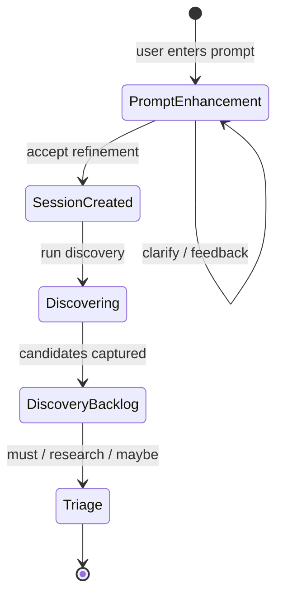
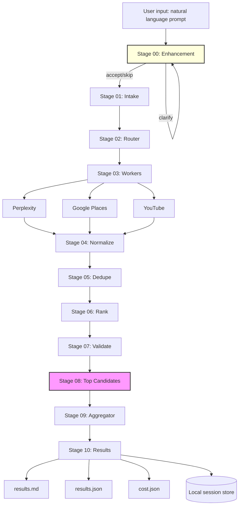

# Phase 0 PRD — Travel Discovery Orchestrator (CLI-first)

**Owner:** Rajan

**Status:** Final (Implementation Ready)

**Last updated:** 2026-01-05

**Version:** 1.3

---

## Table of Contents

0. [Development Infrastructure — Context Persistence](#0-development-infrastructure--context-persistence)
1. [Executive Summary](#1-executive-summary)
2. [Problem Statement](#2-problem-statement)
3. [Scope](#3-scope)
4. [Goals and Success Metrics](#4-goals-and-success-metrics)
5. [Personas](#5-personas)
6. [User Journeys](#6-user-journeys)
7. [High-Level Workflow Model](#7-high-level-workflow-model)
8. [Functional Requirements](#8-functional-requirements)
9. [Model Strategy](#9-model-strategy)
10. [Architecture](#10-architecture)
11. [Pipeline Execution Model](#11-pipeline-execution-model)
12. [Data Model](#12-data-model)
13. [Storage Layout](#13-storage-layout)
14. [Ranking, Dedupe, and Clustering](#14-ranking-dedupe-and-clustering)
15. [YouTube Social Signals](#15-youtube-social-signals)
16. [CLI Specification](#16-cli-specification)
17. [Non-Functional Requirements](#17-non-functional-requirements)
18. [Evaluation Harness](#18-evaluation-harness)
19. [Acceptance Criteria](#19-acceptance-criteria)
20. [Telegram Interface Architecture](#20-telegram-interface-architecture)
21. [Multimodal Input Processing](#21-multimodal-input-processing)
22. [HTML Output Generation](#22-html-output-generation)
23. [Mac Studio Operations](#23-mac-studio-operations)
24. [Job Queue & Processing](#24-job-queue--processing)
25. [Delivery Plan](#25-delivery-plan)
26. [Risks and Mitigations](#26-risks-and-mitigations)
27. [Resolved Questions](#27-resolved-questions)
28. [API Keys and Secrets](#28-api-keys-and-secrets)
29. [Appendix A: TypeScript Types](#appendix-a-typescript-types)
30. [Appendix B: results.md Template](#appendix-b-resultsmd-template)
31. [Appendix C: Prompt Templates](#appendix-c-prompt-templates)

---

## 0. Development Infrastructure — Context Persistence

> **Phase 0.0** — This section defines the meta-infrastructure for Claude Code session management, enabling context persistence across development sessions.

### 0.1 Problem Statement

Claude Code sessions are ephemeral. When a session ends, all accumulated context (what was built, decisions made, issues encountered, what's left to do) is lost. Starting a new session requires manually re-reading the PRD, TODO, and journal to rebuild context, consuming significant context window space.

**Pain Points:**
- Starting new sessions wastes ~4000+ lines of context reading documentation
- No semantic search across historical context
- Manual journaling is error-prone and often forgotten
- Context window is precious and should be preserved for actual work

### 0.2 Solution: Vector-Based Context Persistence

Implement a RAG (Retrieval Augmented Generation) system using:
- **LanceDB**: Embedded, serverless vector database (Node.js native)
- **OpenAI text-embedding-3-small**: High-quality embeddings at low cost
- **Auto-journaling**: Triggered when TODO items are marked complete or significant changes occur

### 0.3 Architecture

```
┌─────────────────────────────────────────────────────────────┐
│                    Claude Code Session                       │
├─────────────────────────────────────────────────────────────┤
│                                                              │
│  /startagain ──┐                      ┌── /journal           │
│                │                      │                      │
│                ▼                      ▼                      │
│         ┌───────────┐          ┌───────────┐                │
│         │  Retrieve │          │   Store   │                │
│         │  Context  │          │  Context  │                │
│         └─────┬─────┘          └─────┬─────┘                │
│               │                      │                       │
└───────────────┼──────────────────────┼───────────────────────┘
                │                      │
                ▼                      ▼
        ┌───────────────────────────────────────┐
        │              LanceDB                   │
        │  ┌─────────────────────────────────┐  │
        │  │  Collections:                    │  │
        │  │  • journal_entries              │  │
        │  │  • todo_snapshots               │  │
        │  │  • prd_sections                 │  │
        │  │  • session_summaries            │  │
        │  └─────────────────────────────────┘  │
        │              ▲                        │
        │              │                        │
        │    OpenAI text-embedding-3-small     │
        └───────────────────────────────────────┘
```

### 0.4 Data Collections

| Collection | Purpose | Chunking Strategy |
|------------|---------|-------------------|
| `journal_entries` | Session retrospectives with work completed, issues, decisions | Per session entry (~500-1000 tokens each) |
| `todo_snapshots` | Point-in-time TODO state for tracking progress | Per major section, with completion status |
| `prd_sections` | PRD content for requirement lookups | Per section header (~1000 tokens each) |
| `session_summaries` | Condensed session context for quick retrieval | Single doc per session (~200-300 tokens) |

### 0.5 Command Behavior

#### `/startagain` (Enhanced)

1. Query `session_summaries` for most recent 2-3 sessions
2. Query `todo_snapshots` for current state
3. Query `journal_entries` semantically for relevant prior context
4. Retrieve only the sections of PRD relevant to current work
5. Present condensed context (~500-800 lines vs ~4000)
6. Ask what to focus on this session

**Context Window Savings:** ~75-80% reduction in startup context

#### `/journal` (Enhanced)

1. Auto-triggered when:
   - 3+ TODO items marked complete in a session
   - User explicitly runs `/journal`
   - Session ends with significant changes detected
2. Generate session summary using conversation context
3. Create embeddings for:
   - Full journal entry → `journal_entries`
   - Condensed summary → `session_summaries`
   - Updated TODO snapshot → `todo_snapshots`
4. Store with metadata (timestamp, session_id, topics covered)

### 0.6 Storage Location

```
~/.travelagent/
├── context/
│   ├── lancedb/           # LanceDB database files
│   │   ├── journal_entries.lance
│   │   ├── todo_snapshots.lance
│   │   ├── prd_sections.lance
│   │   └── session_summaries.lance
│   └── embeddings_cache/  # Optional: cache embeddings to reduce API calls
├── data/                  # Existing travel session data
└── ...
```

### 0.7 Implementation Requirements

#### Dependencies
```json
{
  "vectordb": "^0.4.0",      // LanceDB Node.js client
  "openai": "^4.x",          // For embeddings API
  "@lancedb/lancedb": "^0.4" // LanceDB core
}
```

#### Environment Variables
```bash
# .env (existing key, reused for embeddings)
OPENAI_API_KEY=sk-...
```

#### Embedding Configuration
- Model: `text-embedding-3-small`
- Dimensions: 1536 (default) or 512 (for cost savings)
- Cost: ~$0.02 per 1M tokens
- Estimated usage: ~50-100 embeddings per session = ~$0.001/session

### 0.8 Auto-Journal Trigger Logic

```typescript
interface AutoJournalConfig {
  // Trigger when N todos are marked complete
  todoCompletionThreshold: 3;

  // Trigger after N significant tool calls (file writes, etc.)
  significantActionThreshold: 10;

  // Types of actions considered "significant"
  significantActions: [
    'Edit', 'Write', 'Bash:git commit', 'TodoWrite:completed'
  ];

  // Minimum session duration before auto-journal (minutes)
  minSessionDuration: 15;
}
```

### 0.9 Success Metrics

| Metric | Target | Measurement |
|--------|--------|-------------|
| Context reduction | ≥70% fewer lines at session start | Compare before/after |
| Retrieval relevance | Top 3 results contain relevant context | Manual spot check |
| Storage efficiency | <10MB per 100 sessions | Disk usage monitoring |
| Embedding latency | <2s for retrieval query | Timing measurement |
| Auto-journal accuracy | Captures key decisions/issues | Manual review |

### 0.10 Risks and Mitigations

| Risk | Likelihood | Impact | Mitigation |
|------|------------|--------|------------|
| Embedding API unavailable | Low | Medium | Cache embeddings locally, fallback to keyword search |
| LanceDB corruption | Low | High | Regular backups to `context/backups/` |
| Context drift over time | Medium | Medium | Periodic re-indexing of PRD/TODO |
| Storage growth | Low | Low | Automatic pruning of sessions >90 days old |

---

## 1. Executive Summary

Phase 0 delivers a **CLI-first Discovery engine** for a travel planning app. Users create travel **Sessions** (destination, dates, flexibility, interests, constraints). A **Router + Workers + Aggregator** pipeline runs in parallel to produce:

- **results.md**: Human-friendly markdown for fast scanning and decision making
- **results.json**: Canonical structured output designed to be used later by a web UI

**Key architectural features:**

1. **Prompt Enhancement (Stage 00):** Before session creation, vague or incomplete user prompts are analyzed, clarified through interactive questions if needed, and refined into structured session parameters. This ensures the discovery pipeline receives high-quality input.

2. **Stage-based Pipeline:** The pipeline is divided into explicit **stages**, each producing a JSON checkpoint. This enables debugging, resuming from any stage, and iterating on components (like the aggregator) without re-running upstream stages.

Phase 0 intentionally does **not** include:
- Flights, bookings, payments, or ticketing
- Vision/multimodal input (deferred to Phase 2+)

The focus is proving that multi-source orchestration produces consistently useful, trustworthy discovery results and clean handoff into a lightweight triage state.

---

## 2. Problem Statement

Planning travel often starts with scattered inspiration, fragmented research, and inconsistent note-taking. Users need a workflow that:

- Captures vague or specific travel ideas
- Converts them into a structured backlog of candidates
- Allows prioritization and refinement
- Preserves provenance so results are trustworthy

The biggest early risk is building UI and infrastructure before validating that "Discovery orchestration" reliably produces good outputs.

---

## 3. Scope

### 3.1 In Scope (Phase 0)

- **Prompt Enhancement with interactive clarification (Stage 00)**
- Session creation and management with human-readable IDs
- Discovery orchestration pipeline with pluggable workers
- **Stage-based execution with JSON checkpoints at each stage**
- **Resume/replay from any stage without re-running upstream stages**
- Canonical normalization into a Candidate schema
- Dedupe and clustering (two-phase: hash + similarity)
- Ranking with multi-dimensional scoring and diversity constraints
- Social signals via YouTube (official API + transcript extraction)
- Validation of social-derived candidates using Perplexity
- Lightweight triage status per candidate: Must do, Research, Maybe
- Local storage of runs, outputs, and raw worker results
- Schema versioning with lazy migration
- Cost tracking and display after each run
- Error recovery with retry, circuit breaker, and graceful degradation
- Evaluation harness for repeatability and quality checks

### 3.2 Out of Scope (Phase 0)

- Booking flows: flights, hotels, tickets
- Real-time pricing guarantees
- Payments, loyalty, checkout
- Multi-user collaboration, sharing, permissions
- Full scheduling calendar UI
- Automated scraping that violates platform terms
- **Vision/multimodal input** (images, screenshots) — deferred to Phase 2+
- **Instagram social signals** — replaced with YouTube

### 3.3 Assumptions

- User has Node.js 18+ installed
- User has API keys for required services
- Local filesystem storage is acceptable for Phase 0
- Single-user, single-machine usage pattern
- English language content is primary focus

### 3.4 Dependencies

| Dependency | Type | Required |
|------------|------|----------|
| Perplexity Sonar API | External API | Yes |
| Google Places API | External API | Yes |
| YouTube Data API v3 | External API | Yes |
| youtube-transcript npm | NPM Package | Yes |
| OpenAI API (GPT-5.2) | External API | Yes |
| Google AI (Gemini 3) | External API | Yes |

---

## 4. Goals and Success Metrics

### 4.1 Product Goals

1. **Vague or incomplete prompts are refined into structured, actionable session parameters**
2. Users can create and revisit Sessions representing travel ideas
3. A Discovery run returns a ranked, deduped, well-cited set of Candidates
4. Discovery output is durable and UI-ready (JSON contract)
5. Social inspiration is surfaced as "signals" and validated
6. Users can triage candidates and preserve triage across runs
7. Costs are visible and tracked per run
8. **Users can resume from any pipeline stage for debugging and iteration**

### 4.2 Success Metrics (Phase 0)

| Goal | Metric | Target | Measurement |
|------|--------|--------|-------------|
| **Enhancement** | Vague prompts produce valid session params after enhancement | 100% | Automated schema check |
| **Utility** | Positive rating on top 10 results | ≥ 80% of runs | Manual eval on test set |
| **Trust** | Candidates with SourceRef or marked Needs verification | 100% | Automated schema check |
| **Repeatability** | Valid JSON output on every run | 100% | Automated schema validation |
| **Resilience** | Pipeline completes with partial results if one worker fails | 100% | Integration tests |
| **Cost Visibility** | Cost breakdown displayed after run | 100% | CLI output verification |
| **Performance** | Discovery run completes | < 60 seconds | Timing measurement |
| **Debuggability** | All stages produce valid JSON checkpoints | 100% | Schema validation |

---

## 5. Personas

### 5.1 Explorer
Has a vague idea and wants inspiration. May say "somewhere warm in March" or "beach vacation ideas." Needs the system to generate diverse options.

### 5.2 Curator
Wants a shortlist and prioritization. Has a specific destination in mind and needs organized, verified information. Values source credibility.

### 5.3 Planner (Future)
Will convert shortlisted items into an itinerary in later phases. Not the focus of Phase 0.

---

## 6. User Journeys

### 6.1 Journey A: Prompt Enhancement (Vague Input)

1. User enters a vague prompt: "Somewhere warm in March"
2. System detects ambiguity, asks 2-3 clarifying questions
3. User answers: "Southeast Asia, beaches, 10 days, couple's trip"
4. System suggests refined prompt with extracted parameters
5. User accepts, session is created with structured params

**CLI Example:**
```bash
travel sessions:create --prompt "Somewhere warm in March"

# System asks clarifying questions:
#   1. Which region interests you? (e.g., Caribbean, Southeast Asia, Mediterranean)
#   2. What type of experience? (beach, adventure, culture, relaxation)
#   3. How long is your trip?

# User answers...

# Suggested refinement:
#   "Southeast Asia beach vacation in March 2026, 10 days, relaxation-focused
#    couple's trip. Considering Thailand, Vietnam, or Bali."
#
#   Extracted: destinations=["Thailand","Vietnam","Bali"], dates=March 2026,
#              interests=["beach","relaxation"], constraints={"travelers":"couple"}

# [A] Accept  [R] Reject  [F] Feedback

# Created session: 20260102-southeast-asia-beach-march
```

### 6.2 Journey B: Basic Discovery (Clear Input)

1. User creates a Session: "Japan in April, flexible by 7 days, food and temples"
2. System recognizes clear prompt, suggests minor refinements
3. User accepts, runs discovery via CLI
4. Reviews markdown summary and top picks
5. Marks 5 items Must do, 5 items Research
6. Exports results

**CLI Example:**
```bash
travel sessions:create --prompt "Japan in April, flexible by 7 days, food and temples"

# Prompt is clear. Suggested refinement:
#   "Japan in April 2026, focusing on temples and authentic cuisine.
#    Flexible dates ±7 days to catch cherry blossom season."
#
#   Extracted: destinations=["Japan"], dates=April 1-14 2026 (±7 days),
#              interests=["temples","food","cherry blossoms"]

# [A] Accept  [R] Reject  [F] Feedback

# Created session: 20260102-japan-food-temples

travel run 20260102-japan-food-temples

travel triage:set <candidate_id> --status must
travel triage:set <candidate_id> --status research

travel export 20260102-japan-food-temples --bundle
```

### 6.3 Journey C: Social-Enhanced Discovery

1. User creates a Session: "Italy in May, wine and history"
2. YouTube worker pulls relevant travel vlog content
3. Social-derived candidates are validated via Perplexity
4. Conflicts and unverified items are surfaced clearly
5. User reviews with confidence levels visible

### 6.4 Journey D: Constrained Trip

1. User creates a Session with constraints: "Tokyo, family-friendly, wheelchair accessible"
2. Router adjusts worker queries to include constraint keywords
3. Results are filtered and ranked considering accessibility
4. Candidates lacking constraint compliance are flagged

### 6.5 Journey E: Iterating on Aggregator (Developer Workflow)

1. User runs a full discovery: `travel run 20260102-japan-food-temples`
2. Wants to test different aggregator prompts without re-running workers
3. Resumes from the top_candidates stage: `travel run 20260102-japan-food-temples --from-stage 08`
4. Compares results between runs
5. Repeats until satisfied with aggregator output

---

## 7. High-Level Workflow Model



**Note:** "Planning board" and "Scheduling" are future phases. In Phase 0 we only persist triage state to prove the handoff. Prompt Enhancement is an interactive pre-processing step that can be skipped with `--skip-enhancement`.

---

## 8. Functional Requirements

### FR0: Prompt Enhancement

Before a Session is created, the user's natural language input is analyzed and refined to ensure the discovery pipeline can produce high-quality results. This is an **optional, interactive** pre-processing step.

#### FR0.1 Problem and Solution

**Problem:** Users often provide vague or incomplete travel prompts:
- "Somewhere warm in March" — no destination specificity
- "Japan trip" — missing dates, interests, constraints
- "Family vacation ideas" — no destination or timeframe

**Solution:** An LLM-powered Prompt Enhancer that:
1. Evaluates prompt clarity across travel-specific dimensions
2. Asks clarifying questions when ambiguous
3. Suggests refined prompts that extract structured Session parameters
4. Allows user feedback and iteration

#### FR0.2 Evaluation Dimensions

The Prompt Enhancer evaluates user input across **5 travel-specific dimensions**:

| Dimension | Weight | What It Checks | Example (Good) | Example (Bad) |
|-----------|--------|----------------|----------------|---------------|
| **Destination Specificity** | 30% | Is there a concrete, searchable location? | "Kyoto, Japan" | "Somewhere in Asia" |
| **Temporal Clarity** | 25% | Are dates/season/duration specified? | "April 1-14, 2026" | "Sometime next year" |
| **Interest Articulation** | 20% | Are activities/themes clear? | "temples, ramen, cherry blossoms" | "stuff to do" |
| **Constraint Definition** | 15% | Are limitations stated? | "wheelchair accessible, under $200/day" | (none stated) |
| **Trip Type** | 10% | Solo/couple/family/group? Duration style? | "10-day family trip" | (ambiguous) |

**Decision Logic:**

- **Clear (proceed with refinement suggestion):** At least 3 dimensions are reasonably inferable, destination OR temporal context is present
- **Ambiguous (ask clarifying questions):** Fewer than 3 dimensions inferable, or both destination AND dates are missing

#### FR0.3 Enhancement Flow

```
User Input (natural language)
    |
    v
+-------------------------------------+
|  Prompt Enhancer (LLM)              |
|  - Analyze across 5 dimensions      |
|  - Determine: clear or ambiguous?   |
+-------------------------------------+
    |
    v
+--------------+------------------------+
|  CLEAR       |  AMBIGUOUS             |
+--------------+------------------------+
| Show:        | Show:                  |
| - Refined    | - 2-4 clarifying       |
|   prompt     |   questions            |
| - Extracted  |                        |
|   params     |                        |
+--------------+------------------------+
| User:        | User:                  |
| - Accept     | - Answer questions     |
| - Reject     | - Skip (use original)  |
| - Feedback   |                        |
+--------------+------------------------+
    |
    v
+-------------------------------------+
|  EnhancementResult                  |
|  - refinedPrompt: string            |
|  - extractedParams: SessionParams   |
|  - wasEnhanced: boolean             |
+-------------------------------------+
    |
    v
Session Creation (FR1)
```

#### FR0.4 Clarifying Questions

When the prompt is ambiguous, generate 2-4 targeted questions:

| Category | Example Question |
|----------|------------------|
| Destination | "Which region or country are you most interested in? (e.g., Southeast Asia, Mediterranean, Japan)" |
| Timing | "When are you planning to travel? (specific dates, month, or season)" |
| Duration | "How long is your trip? (weekend, 1 week, 2+ weeks)" |
| Interests | "What experiences are most important? (food, culture, adventure, relaxation, nature)" |
| Constraints | "Any must-haves or deal-breakers? (budget, accessibility, dietary, family-friendly)" |
| Trip Style | "Who's traveling? (solo, couple, family with kids, group of friends)" |

**Question Rules:**
- Maximum 4 questions per iteration
- Prioritize questions for missing CRITICAL dimensions (destination, timing)
- Skip questions for dimensions already clear from input
- Questions should be conversational, not interrogative

#### FR0.5 Suggested Refinement

When prompt is clear, suggest an optimized version with extracted parameters:

**Input:** "Japan in April, food and temples"

**Suggested Refinement:**
```
Exploring Japan in April 2026, focusing on:
- Traditional temples and shrines (Kyoto, Nara)
- Authentic Japanese cuisine (ramen, sushi, izakaya, street food)
- Cherry blossom season experiences

Trip style: Flexible dates (±7 days around early-mid April)
```

**Extracted Parameters:**
```json
{
  "destinations": ["Japan"],
  "dateRange": { "start": "2026-04-01", "end": "2026-04-14" },
  "flexibility": { "type": "plusMinusDays", "days": 7 },
  "interests": ["temples", "shrines", "ramen", "sushi", "izakaya", "cherry blossoms"],
  "constraints": {},
  "inferredTags": ["culture", "food", "spring", "photography"]
}
```

#### FR0.6 User Actions

| Action | Behavior |
|--------|----------|
| **Accept** | Use refined prompt and extracted params for Session creation |
| **Reject** | Use original prompt as-is, attempt best-effort param extraction |
| **Feedback** | Provide specific adjustments, trigger re-enhancement |
| **Skip** | Bypass enhancement entirely (CLI flag: `--skip-enhancement`) |

#### FR0.7 Iteration and Timeouts

- **Max iterations:** 3 (configurable)
- **Timeout per LLM call:** 15 seconds
- **Total enhancement timeout:** 60 seconds (including user input time)

If max iterations reached without acceptance, use the last suggested refinement.

#### FR0.8 Graceful Degradation

Enhancement failure is **non-fatal**:

| Scenario | Behavior |
|----------|----------|
| LLM timeout | Log warning, proceed with original prompt |
| LLM error | Log warning, proceed with original prompt |
| Invalid JSON response | Retry once, then proceed with original |
| User Ctrl+C | Proceed with original prompt |

The pipeline MUST continue even if enhancement fails entirely.

#### FR0.9 Output Schema

```typescript
interface EnhancementResult {
  originalPrompt: string;
  refinedPrompt: string;
  wasEnhanced: boolean;
  extractedParams: Partial<SessionParams>;
  iterationCount: number;
  modelUsed: string;
  processingTimeMs: number;
}

interface PromptAnalysis {
  isClear: boolean;
  confidence: number;  // 0.0-1.0
  suggestedRefinement?: string;
  extractedParams?: Partial<SessionParams>;
  clarifyingQuestions?: string[];  // 2-4 questions when isClear=false
  reasoning: string;
  detectedIntents?: string[];
}
```

---

### FR1: Session Management

**Create Session with:**
- destination(s) — required, string array
- date range (start, end) — required, ISO date strings
- flexibility (none, plus-minus days, month-only) — required
- interests (tags) — required, string array
- optional constraints (kid-friendly, mobility, dietary, budget band)

**Operations:**
- `sessions:create` — Create new session (generates human-readable ID)
- `sessions:list` — List all sessions
- `sessions:view <session_id>` — View session details
- `sessions:archive <session_id>` — Soft-delete session

---

### FR2: Discovery Run Orchestration

A discovery run executes as a series of **stages**, each producing a JSON checkpoint:

**Stage 01: Intake**
- Snapshot session parameters for this run
- Generate `run_id` (human-readable: `YYYYMMDD-HHMMSS-<mode>`)
- Create run directory structure
- Output: `01_intake.json`

**Stage 02: Routing**
- Generate WorkerPlan via Router model
- Timeout: 5 seconds
- On failure: Use default WorkerPlan (all workers, standard queries)
- Output: `02_router_plan.json`

**Stage 03: Worker Execution**
- Execute all planned workers via `Promise.allSettled`
- Per-worker timeout: 8 seconds (configurable)
- Concurrency limit: 3 simultaneous external API calls
- Output: `03_worker_outputs/` directory with per-worker JSON files

**Stage 04: Normalization**
- Convert each worker's raw output to `Candidate[]`
- Timeout: 10 seconds per worker's output
- On failure: Skip that worker's candidates, log error
- Output: `04_candidates_normalized.json`

**Stage 05: Deduplication**
- Two-phase dedupe: hash-based then similarity-based
- Form clusters of related candidates
- Output: `05_candidates_deduped.json`

**Stage 06: Ranking**
- Score candidates on relevance, credibility, recency, diversity
- Sort by overall score
- Output: `06_candidates_ranked.json`

**Stage 07: Validation** (if YouTube candidates present)
- Validate top N YouTube candidates via Perplexity
- N = min(10, youtube_candidate_count)
- Timeout: 3 seconds per validation
- On failure: Mark as `unverified`, continue
- Output: `07_candidates_validated.json`

**Stage 08: Top Candidates Selection**
- Select top N candidates for aggregator (default 30)
- Enforce diversity constraints
- Output: `08_top_candidates.json`

**Stage 09: Aggregation**
- Generate structured narrative via Aggregator LLM
- Timeout: 20 seconds
- On failure: Output raw candidates without narrative (degraded mode)
- Output: `09_aggregator_output.json`

**Stage 10: Finalization**
- Generate `results.json` and `results.md`
- Write cost summary to `cost.json`
- Display cost breakdown in CLI
- Update session's `last_run_id`
- Output: `10_results.json`, `results.md`

**Partial Results Guarantee:** If at least one worker returns ≥1 candidate, the run succeeds with partial results. Empty runs (0 candidates) are marked as failures.

---

### FR3: Router

The Router produces a **WorkerPlan** containing:

- **enrichedIntent** — Parsed user intent and constraints
- **queryVariants** — Search queries tailored per worker
- **workers** — List of workers to invoke
- **budgets** — Per-worker limits (max calls, timeouts)
- **validationPlan** — Which candidates need verification

**Router Input:**
```typescript
interface RouterInput {
  session: Session;
  availableWorkers: string[];
}
```

**Router Output:**
```typescript
interface WorkerPlan {
  enrichedIntent: {
    destinations: string[];
    dateRange: { start: string; end: string };
    flexibility: Flexibility;
    interests: string[];
    constraints: Record<string, unknown>;
    inferredTags: string[];
  };
  workers: Array<{
    workerId: string;
    queries: string[];
    maxResults: number;
    timeout: number;
  }>;
  validationPlan: {
    validateTopN: number;
    origins: string[];
  };
}
```

---

### FR4: Vision Context Extraction

**Status: Deferred to Phase 2+**

Multimodal input (images, screenshots, maps) is out of scope for Phase 0. The architecture supports future addition via a Vision Context Worker.

---

### FR5: Workers (Phase 0 Set)

Phase 0 workers are pluggable. Each implements:

```typescript
interface Worker {
  id: string;
  provider: string;
  plan(session: Session, enrichedIntent: EnrichedIntent): WorkerPlan;
  execute(plan: WorkerPlan, context: WorkerContext): Promise<WorkerOutput>;
}

interface WorkerOutput {
  workerId: string;
  status: 'ok' | 'error' | 'partial' | 'skipped';
  candidates: Candidate[];
  rawData?: unknown;
  error?: string;
  durationMs: number;
  tokenUsage?: { input: number; output: number };
}
```

#### FR5.1: Web Knowledge Worker (Perplexity)

- Uses Perplexity Sonar API to research destination and interests
- Generates grounded answers with inline citations
- Extracts discrete Candidates from Perplexity responses
- Output normalized Candidates with SourceRefs from Perplexity citations

**API:** `POST https://api.perplexity.ai/chat/completions`
**Model:** `sonar-pro`
**Output:** Candidates with `origin = 'web'`

#### FR5.2: Places Worker (Google Places API)

- Queries Google Places API for POIs matching destination and interests
- Retrieves place details: name, address, ratings, reviews, photos, opening hours
- Generates synthetic SourceRef using Google Maps URL

**API:** Google Places API (Text Search + Place Details)
**Output:** Candidates with `origin = 'places'`
**SourceRef URL format:** `https://maps.google.com/?cid=<place_id>`

#### FR5.3: YouTube Social Signals Worker

- Searches YouTube for travel content matching destination and interests
- Fetches video metadata via YouTube Data API v3
- Extracts transcripts via `youtube-transcript` npm package
- Uses LLM to extract place recommendations from transcripts
- Produces Candidates tagged `origin = 'youtube'` and `confidence = 'provisional'`

See [Section 15: YouTube Social Signals](#15-youtube-social-signals) for full specification.

---

### FR6: Social Validation via Perplexity

For top N YouTube-derived candidates (default 10), validate:
- Place existence
- Correct location
- Obvious closure or mismatch

**Output validation status:**
- `verified` — All claims confirmed
- `partially_verified` — Some claims confirmed
- `conflict_detected` — Information contradicts sources
- `unverified` — Could not validate

Mark conflicts and unverified items clearly in markdown output.

---

### FR7: Triage State

User can assign each Candidate to:
- **Must do** — Definite inclusion
- **Research** — Needs more investigation
- **Maybe** — Low priority consideration

**Persistence rules:**
- Triage persists across discovery reruns
- Matching by `candidateId` (if stable) or title + location hash
- New candidates from re-runs start with no triage status
- Removed candidates retain triage history (for recovery)

---

### FR8: Export

Export a bundle per Session containing:
- `results.json` — Latest discovery results
- `results.md` — Human-readable summary
- `triage.json` — Current triage state
- `session.json` — Session configuration
- `cost.json` — Run cost breakdown
- `stages/` — Optional stage files (with `--include-stages` flag)
- `raw/` — Optional raw worker outputs (with `--include-raw` flag)

**Bundle format:** Directory or ZIP archive (`--zip` flag)

---

### FR9: Stage Snapshotting and Resume

#### FR9.1: Stage Persistence

- Every pipeline stage MUST produce a JSON checkpoint file
- Stage files MUST include standard metadata (`_meta` block)
- Stage files MUST be written atomically (temp file + rename)
- Failed stages MUST NOT produce partial stage files

#### FR9.2: Resume Capability

- User MUST be able to resume from any completed stage
- Resume MUST skip all upstream stages
- Resume MUST use the exact stage file content (no re-fetching)
- Resume MUST create a new run with `mode: 'from-stage'`

**CLI:**
```bash
# Resume from top_candidates stage of latest run
travel run <session_id> --from-stage 08

# Resume from a specific run's stage
travel run <session_id> --from-stage 08 --source-run <run_id>

# Shorthand for aggregator-only testing
travel run <session_id> --aggregate-only
```

#### FR9.3: Seed Capability

- User MUST be able to seed a new session from a prior stage file
- Seed MUST copy the stage file (not reference)
- Seed MUST record provenance in `run.json`

**CLI:**
```bash
# Create new session seeded from another session's top_candidates
travel sessions:create --seed-from <session_id>/08

# Seed from exported file
travel sessions:create --seed-file ./my_candidates.json
```

#### FR9.4: Manifest Integrity

- Every run MUST produce a `manifest.json`
- Manifest MUST include SHA-256 hash of each stage file
- Manifest MUST record execution order and skipped stages

#### FR9.5: Human-Readable IDs

- Session IDs MUST follow format: `YYYYMMDD-<slug>`
- Run IDs MUST follow format: `YYYYMMDD-HHMMSS[-mode]`
- Slug MUST be derived from session destination and interests
- ID collisions MUST be handled with numeric suffix

---

## 9. Model Strategy

Phase 0 uses multiple models for different responsibilities. Models are configured per task type so you can swap providers without rewriting orchestration.

### 9.1 Model Configuration

| Task | Default Model | Model ID | Env Override | Notes |
|------|---------------|----------|--------------|-------|
| **Prompt Enhancement** | Gemini 3 Flash | `gemini-3-flash-preview` | `ENHANCEMENT_MODEL` | Fast, interactive |
| Router | Gemini 3 Flash | `gemini-3-flash-preview` | `ROUTER_MODEL` | Fast, balanced |
| Worker Normalization | Gemini 3 Flash | `gemini-3-flash-preview` | `NORMALIZER_MODEL` | Batch processing |
| Aggregator | GPT-5.2 | `gpt-5.2` | `AGGREGATOR_MODEL` | Strong reasoning |
| Long Context Merge | Gemini 3 Pro | `gemini-3-pro-preview` | `LONG_CONTEXT_MODEL` | Large context |
| Social Validation | Perplexity Sonar | `sonar-pro` | — | Grounded search |
| YouTube Extraction | Gemini 3 Flash | `gemini-3-flash-preview` | `YOUTUBE_MODEL` | Transcript parsing |

All models must support structured output (JSON mode or tool use).

**Temperature settings:**
- Enhancement: 0.3 (consistent analysis)
- Router: 0.3 (consistent planning)
- Normalization: 0.2 (faithful extraction)
- Aggregator: 0.5 (balanced creativity/accuracy)

### 9.2 Model Rules

- Aggregator must not introduce factual claims without evidence
- Each Candidate must include at least one SourceRef or be explicitly flagged `needs_verification`
- Social-derived candidates start as `provisional` until validated
- All LLM outputs must be valid JSON (use structured output modes)

### 9.3 Cost and Latency Control

**Per-Run Token Budgets:**

| Task | Max Input Tokens | Max Output Tokens |
|------|------------------|-------------------|
| Enhancement (per iteration) | 2,000 | 1,000 |
| Router | 4,000 | 2,000 |
| Per-Worker Normalization | 8,000 | 4,000 |
| Aggregator | 32,000 | 8,000 |
| Per-Validation | 2,000 | 500 |

**Cost Tracking Implementation:**

Adapted from `linkedinquotes` reference implementation:

```typescript
interface TokenUsage {
  perplexity?: { inputTokens: number; outputTokens: number };
  gemini?: { inputTokens: number; outputTokens: number };
  openai?: { inputTokens: number; outputTokens: number };
}

const TOKEN_COSTS = {
  perplexity: { inputPerMillion: 3.0, outputPerMillion: 15.0 },
  gemini: { inputPerMillion: 0.5, outputPerMillion: 3.0 },
  openai: { inputPerMillion: 10.0, outputPerMillion: 30.0 },
};

interface CostBreakdown {
  perplexity: number;
  gemini: number;
  openai: number;
  places: number;  // API call cost
  youtube: number; // API call cost (if applicable)
  total: number;
}
```

**CLI Cost Display (Required):**

```
═══════════════════════════════════════════════════════
  Discovery Run Complete
═══════════════════════════════════════════════════════
  Candidates found:     42
  Duration:             12.3s
───────────────────────────────────────────────────────
  Cost Breakdown:
    Perplexity:         $0.0450
    Gemini (Router):    $0.0012
    GPT-5.2 (Aggregator): $0.1200
    ─────────────────────────────
    Total:              $0.1662
═══════════════════════════════════════════════════════
```

---

## 10. Architecture

### 10.1 System Diagram



**Note:** Stage 00 (Enhancement) is interactive and can be skipped. Stage 08 (Top Candidates) is the key resume point for aggregator testing.

### 10.2 Component Descriptions

| Component | Responsibility |
|-----------|---------------|
| **Prompt Enhancer** | Analyzes user prompts, asks clarifying questions, extracts structured params |
| **Router** | Parses user intent, generates WorkerPlan, allocates budgets |
| **Web Knowledge Worker** | Queries Perplexity for destination research, extracts candidates |
| **Places Worker** | Queries Google Places API for POIs, retrieves details |
| **YouTube Worker** | Searches videos, extracts transcripts, mines recommendations |
| **Validator** | Verifies social-derived candidates via Perplexity |
| **Aggregator** | Dedupes, clusters, ranks, generates outputs |
| **Cost Tracker** | Accumulates token usage, calculates costs |
| **Session Store** | Persists sessions, runs, triage state to filesystem |

### 10.3 Execution Model

- Use parallel execution with `Promise.allSettled`
- Partial results are allowed and expected
- Errors are recorded per worker and surfaced in run summary
- Circuit breaker prevents cascading failures
- **Each stage writes a checkpoint before proceeding to the next**

---

## 11. Pipeline Execution Model

### 11.1 Human-Readable ID Conventions

#### Session ID Format

```
<YYYYMMDD>-<slug>
```

**Components:**
- `YYYYMMDD` — Date session was created
- `slug` — Sanitized summary derived from user prompt (destination + interests), max 50 characters

**Slug Generation Rules:**
1. Extract high-signal tokens: destination(s), month/season, trip type, 1-2 interests
2. Lowercase all characters
3. Replace spaces and special characters with hyphens
4. Remove stopwords: `the`, `a`, `an`, `trip`, `plan`, `to`, `in`, `for`, `my`, `our`
5. Remove emoji and punctuation
6. Collapse multiple hyphens to single hyphen
7. Trim to max 50 characters at word boundary
8. If empty after processing, use `session`

**Collision Handling:** If session ID exists, append `-2`, `-3`, etc.

**Examples:**

| User Prompt | Session ID |
|-------------|------------|
| "Japan in April, temples and food, family trip" | `20260102-japan-april-temples-food-family` |
| "Somewhere warm in March" | `20260102-warm-march` |
| "10 days: Tokyo → Kyoto → Osaka, cherry blossoms" | `20260102-tokyo-kyoto-osaka-cherry-blossoms` |
| "Italy wine regions tour" | `20260102-italy-wine-regions` |

#### Run ID Format

```
<YYYYMMDD>-<HHMMSS>[-<mode>]
```

**Components:**
- `YYYYMMDD-HHMMSS` — Timestamp when run started
- `mode` (optional) — Indicates run type

**Mode Values:**
- `full` — Complete pipeline from intake
- `from-<NN>` — Resumed from stage NN (e.g., `from-08`)
- `aggregate-only` — Only ran aggregator stages

**Examples:**

| Scenario | Run ID |
|----------|--------|
| Full discovery run | `20260102-143512-full` |
| Resume from stage 08 | `20260102-150044-from-08` |
| Aggregator testing | `20260102-151230-aggregate-only` |

---

### 11.2 Pipeline Stages

| Stage | Filename | Description | Key Output |
|-------|----------|-------------|------------|
| **00** | `00_enhancement.json` | **Prompt analysis and refinement** | EnhancementResult |
| 01 | `01_intake.json` | Session params snapshot | Normalized session input |
| 02 | `02_router_plan.json` | Router output | WorkerPlan with queries |
| 03 | `03_worker_outputs/` | Raw worker responses | Per-worker JSON files |
| 04 | `04_candidates_normalized.json` | Normalized candidates | Unified Candidate[] |
| 05 | `05_candidates_deduped.json` | After dedupe/clustering | Candidates with clusters |
| 06 | `06_candidates_ranked.json` | After scoring | Candidates with scores |
| 07 | `07_candidates_validated.json` | After social validation | Validation status |
| 08 | `08_top_candidates.json` | **Resume point** | Top N for aggregator |
| 09 | `09_aggregator_output.json` | Aggregator result | Structured narrative |
| 10 | `10_results.json` | Final export | Complete DiscoveryResults |

**Note:** Stage 00 is executed during `sessions:create` (not `run`). It persists the enhancement result for the session.

---

### 11.3 Stage Metadata

Each stage file includes standard metadata:

```typescript
interface StageMetadata {
  stageId: string;              // e.g., "08_top_candidates"
  stageNumber: number;          // e.g., 8
  stageName: string;            // e.g., "top_candidates"
  schemaVersion: number;        // Stage-specific schema version
  sessionId: string;
  runId: string;
  createdAt: string;            // ISO8601
  upstreamStage?: string;       // Which stage this consumed
  config?: Record<string, unknown>;  // Model/prompt config used
}
```

---

### 11.4 Resume from Stage

**Use Case:** Testing aggregator prompt changes without re-running workers.

**Stage Dependency Rules:**

| Resume From | Executes | Skips |
|-------------|----------|-------|
| `02` (router_plan) | 03-10 | 01 |
| `04` (normalized) | 05-10 | 01-03 |
| `06` (ranked) | 07-10 | 01-05 |
| `08` (top_candidates) | 09-10 | 01-07 |
| `09` (aggregator_output) | 10 | 01-08 |

**Behavior:**
1. Load the specified stage file (e.g., `08_top_candidates.json`)
2. Validate stage file schema
3. Skip upstream stages
4. Execute downstream stages with current config
5. Create new run with `mode: 'from-<NN>'`
6. Record source run in `run.json`

---

### 11.5 Run Configuration Snapshot

Each run produces `run.json` capturing exact configuration:

```typescript
interface RunConfig {
  runId: string;
  sessionId: string;
  startedAt: string;
  completedAt?: string;
  status: 'running' | 'completed' | 'failed' | 'partial';

  // Execution mode
  mode: 'full' | 'from-stage';
  fromStage?: string;
  sourceRunId?: string;

  // Model configuration
  models: {
    enhancement: string;
    router: string;
    normalizer: string;
    aggregator: string;
    validator: string;
  };

  // Prompt versions (for reproducibility)
  promptVersions: {
    enhancement: string;
    router: string;
    aggregator: string;
    youtubeExtraction: string;
    validation: string;
  };

  // Limits
  limits: {
    maxCandidatesPerWorker: number;
    maxTopCandidates: number;
    maxValidations: number;
    workerTimeout: number;
  };

  // Flags
  flags: {
    skipEnhancement: boolean;
    skipValidation: boolean;
    skipYoutube: boolean;
  };

  // Seed provenance (if seeded from another session)
  seedSource?: {
    sessionId: string;
    runId: string;
    stageFile: string;
  };
}
```

---

### 11.6 Manifest File

Each run produces `manifest.json` for integrity verification:

```typescript
interface RunManifest {
  runId: string;
  sessionId: string;
  createdAt: string;

  stages: Array<{
    stageId: string;
    filename: string;
    createdAt: string;
    sha256: string;
    sizeBytes: number;
    upstreamStage?: string;
  }>;

  stagesExecuted: string[];
  stagesSkipped: string[];

  finalStage: string;
  success: boolean;
}
```

---

### 11.7 Example Workflows

#### Workflow 1: Full Discovery Run

```bash
$ travel sessions:create --destination "Japan" --dates "2026-04-01" "2026-04-14" \
    --interests "food,temples"
Created session: 20260102-japan-food-temples

$ travel run 20260102-japan-food-temples
Running full discovery pipeline...
  ✓ 01_intake
  ✓ 02_router_plan
  ✓ 03_worker_outputs (perplexity, places, youtube)
  ✓ 04_candidates_normalized (47 candidates)
  ✓ 05_candidates_deduped (32 unique)
  ✓ 06_candidates_ranked
  ✓ 07_candidates_validated (8/9 verified)
  ✓ 08_top_candidates (30 selected)
  ✓ 09_aggregator_output
  ✓ 10_results

Run complete: 20260102-143512-full
```

#### Workflow 2: Iterate on Aggregator

```bash
# List stages from previous run
$ travel stages:list 20260102-japan-food-temples
Using run: 20260102-143512-full
  ✓ 01_intake.json
  ✓ 02_router_plan.json
  ✓ 03_worker_outputs/
  ...
  ✓ 08_top_candidates.json
  ✓ 09_aggregator_output.json
  ✓ 10_results.json

# Resume from stage 08 with different aggregator
$ travel run 20260102-japan-food-temples --from-stage 08 --aggregator-model gpt-5.2-pro
Resuming from stage 08_top_candidates...
  ⊘ Skipped: 01-07
  ✓ 08_top_candidates (loaded)
  ✓ 09_aggregator_output
  ✓ 10_results

Run complete: 20260102-150044-from-08
```

#### Workflow 3: Seed New Session

```bash
# Create new session using candidates from previous session
$ travel sessions:create --destination "Kyoto" --interests "zen,gardens" \
    --seed-from 20260102-japan-food-temples/08
Created session: 20260102-kyoto-zen-gardens
Seeded with 30 candidates from 20260102-japan-food-temples

$ travel run 20260102-kyoto-zen-gardens
Running from seeded stage 08...
  ⊘ Skipped: 01-07 (seeded)
  ✓ 08_top_candidates (seeded)
  ✓ 09_aggregator_output
  ✓ 10_results
```

---

## 12. Data Model

### 12.1 Schema Versioning Strategy

All persisted schemas include a `schemaVersion` field:

```json
{
  "schemaVersion": 1,
  "sessionId": "20260102-japan-food-temples",
  "title": "Japan in April"
}
```

**Versioning approach:**
- Embedded version field (self-contained, no external manifest)
- Simple integers: `1`, `2`, `3` (no semver)
- Each schema type has independent version numbers

**Migration strategy: Lazy migration on read**
1. Parse JSON
2. Check `schemaVersion` (default to 1 if missing)
3. If version < CURRENT_VERSION, run migration chain
4. Validate against current schema (Zod)
5. Write back migrated file (atomic write)
6. Return typed object

**Atomic write-back:**
```typescript
const tempPath = `${filePath}.tmp.${Date.now()}`;
await fs.writeFile(tempPath, JSON.stringify(migrated, null, 2));
await fs.rename(tempPath, filePath);
```

### 12.2 Version Registry

```typescript
// src/schemas/versions.ts
export const SCHEMA_VERSIONS = {
  enhancement: 1,
  session: 1,
  triage: 1,
  discoveryResults: 1,
  cost: 1,
  stage: 1,
  runConfig: 1,
  manifest: 1,
} as const;
```

### 12.3 Session Schema

```typescript
export type Flexibility =
  | { type: 'none' }
  | { type: 'plusMinusDays'; days: number }
  | { type: 'monthOnly'; month: string };

export type Session = {
  schemaVersion: number;
  sessionId: string;            // Human-readable: YYYYMMDD-slug
  title: string;
  destinations: string[];
  dateRange: { start: string; end: string };
  flexibility: Flexibility;
  interests: string[];
  constraints?: Record<string, unknown>;
  createdAt: string;
  archivedAt?: string;
  lastRunId?: string;
};
```

### 12.4 Candidate Schema

```typescript
export type SourceRef = {
  url: string;
  publisher?: string;
  retrievedAt: string;
  snippet?: string;
};

export type ValidationStatus =
  | 'verified'
  | 'partially_verified'
  | 'conflict_detected'
  | 'unverified'
  | 'not_applicable';

export type CandidateType =
  | 'place'
  | 'activity'
  | 'neighborhood'
  | 'daytrip'
  | 'experience'
  | 'food';

export type CandidateOrigin = 'web' | 'places' | 'youtube';

export type CandidateConfidence =
  | 'needs_verification'  // No SourceRef available
  | 'provisional'         // Social-derived, awaiting validation
  | 'verified'            // Has confirmed SourceRef(s)
  | 'high';               // Multiple high-quality sources

export type Candidate = {
  candidateId: string;
  type: CandidateType;
  title: string;
  summary: string;
  locationText?: string;
  coordinates?: { lat: number; lng: number };
  tags: string[];
  origin: CandidateOrigin;
  sourceRefs: SourceRef[];
  confidence: CandidateConfidence;
  validation?: {
    status: ValidationStatus;
    notes?: string;
    sources?: SourceRef[];
  };
  score: number;
  clusterId?: string;
  metadata?: {
    placeId?: string;         // Google Places ID
    videoId?: string;         // YouTube video ID
    channelName?: string;     // YouTube channel
    viewCount?: number;       // YouTube views
    rating?: number;          // Google rating
    priceLevel?: number;      // Google price level
    timestampSeconds?: number; // Video timestamp
  };
};
```

### 12.5 Triage Schema

```typescript
export type TriageStatus = 'must' | 'research' | 'maybe';

export type TriageEntry = {
  candidateId: string;
  status: TriageStatus;
  notes?: string;
  updatedAt: string;
};

export type TriageState = {
  schemaVersion: number;
  sessionId: string;
  entries: TriageEntry[];
  updatedAt: string;
};
```

### 12.6 Discovery Results Schema

```typescript
export type DegradationLevel =
  | 'none'            // Everything succeeded
  | 'partial_workers' // Some workers failed
  | 'no_aggregation'  // Aggregator failed, raw results
  | 'timeout'         // Run timed out
  | 'failed';         // Zero candidates

export type WorkerSummary = {
  workerId: string;
  status: 'ok' | 'error' | 'partial' | 'skipped';
  durationMs: number;
  candidateCount: number;
  errorMessage?: string;
};

export type ClusterInfo = {
  clusterId: string;
  representativeCandidateId: string;
  alternateCandidateIds: string[];
};

export type DiscoveryResults = {
  schemaVersion: number;
  sessionId: string;
  runId: string;
  createdAt: string;
  durationMs: number;
  enrichedIntent?: Record<string, unknown>;
  candidates: Candidate[];
  clusters?: ClusterInfo[];
  workerSummary: WorkerSummary[];
  degradation: {
    level: DegradationLevel;
    failedWorkers: string[];
    warnings: string[];
  };
};
```

### 12.7 Cost Schema

```typescript
export type CostBreakdown = {
  schemaVersion: number;
  runId: string;
  providers: {
    perplexity?: { tokens: { input: number; output: number }; cost: number };
    gemini?: { tokens: { input: number; output: number }; cost: number };
    openai?: { tokens: { input: number; output: number }; cost: number };
    places?: { calls: number; cost: number };
    youtube?: { units: number; cost: number };
  };
  total: number;
  currency: 'USD';
};
```

---

## 13. Storage Layout

```
~/.travelagent/                                    # Default data directory
├── config.json                                     # Global CLI config
└── sessions/
    └── <session_id>/                               # e.g., 20260102-japan-food-temples
        ├── session.json                            # Session definition
        ├── 00_enhancement.json                     # Prompt enhancement result (Stage 00)
        ├── triage.json                             # Triage state (persists across runs)
        └── runs/
            ├── latest -> 20260102-143512-full      # Symlink to latest run
            └── <run_id>/                           # e.g., 20260102-143512-full
                ├── run.json                        # Run config snapshot
                ├── manifest.json                   # Stage inventory with hashes
                ├── cost.json                       # Cost breakdown
                ├── stages/
                │   ├── 01_intake.json
                │   ├── 02_router_plan.json
                │   ├── 03_worker_outputs/
                │   │   ├── perplexity_raw.json
                │   │   ├── places_raw.json
                │   │   └── youtube_raw.json
                │   ├── 04_candidates_normalized.json
                │   ├── 05_candidates_deduped.json
                │   ├── 06_candidates_ranked.json
                │   ├── 07_candidates_validated.json
                │   ├── 08_top_candidates.json
                │   └── 09_aggregator_output.json
                ├── exports/
                │   ├── 10_results.json
                │   └── results.md
                └── logs/
                    └── run.log                     # Structured log (JSON lines)
```

**Note:** `00_enhancement.json` is stored at session level (not run level) because it captures how the session was created. Subsequent runs use the already-established session parameters.

**Path conventions:**
- Data directory configurable via `TRAVELAGENT_DATA_DIR` env var (default: `~/.travelagent/`)
- Session IDs are human-readable: `YYYYMMDD-<slug>`
- Run IDs are human-readable: `YYYYMMDD-HHMMSS[-mode]`
- JSON files are pretty-printed (2-space indent)
- Symlink `latest` points to most recent run

---

## 14. Ranking, Dedupe, and Clustering

### 14.1 Two-Phase Deduplication Strategy

#### Phase 1: ID-Based (Exact Matches)

```typescript
// If Google place_id matches → immediate merge
// If normalized (title + city) hash matches → merge
function generateCandidateHash(candidate: Candidate): string {
  const seed = `${candidate.metadata?.placeId ?? ''}|${normalizeContent(candidate.title)}|${extractCity(candidate.locationText)}`;
  return createHash('sha256').update(seed).digest('hex').substring(0, 16);
}
```

#### Phase 2: Multi-Signal Similarity

```typescript
function candidateSimilarity(a: Candidate, b: Candidate): number {
  const titleSim = jaccardSimilarity(a.title, b.title);
  const locationSim = calculateLocationSimilarity(a, b);

  // Weighted: 60% title, 40% location
  return (titleSim * 0.6) + (locationSim * 0.4);
}

function jaccardSimilarity(a: string, b: string): number {
  const tokensA = new Set(normalizeContent(a).split(' '));
  const tokensB = new Set(normalizeContent(b).split(' '));
  const intersection = [...tokensA].filter(x => tokensB.has(x));
  const union = new Set([...tokensA, ...tokensB]);
  return intersection.length / union.size;
}

function calculateLocationSimilarity(a: Candidate, b: Candidate): number {
  // If both have coordinates: use haversine distance
  if (a.coordinates && b.coordinates) {
    const distanceM = haversineDistance(a.coordinates, b.coordinates);
    if (distanceM < 50) return 1.0;   // <50m = same place
    if (distanceM < 200) return 0.8;  // <200m = likely same
    if (distanceM < 500) return 0.5;  // <500m = possibly same
    return 0.0;
  }
  // Fallback: normalized location string match
  return jaccardSimilarity(a.locationText ?? '', b.locationText ?? '');
}

// Threshold: 0.80 (80% combined similarity required)
const CANDIDATE_SIMILARITY_THRESHOLD = 0.80;
```

**Normalization pipeline:**
```typescript
function normalizeContent(content: string): string {
  return content
    .toLowerCase()
    .replace(/https?:\/\/\S+/g, '')        // Remove URLs
    .replace(/[\u{1F600}-\u{1F6FF}]/gu, '') // Remove emoji
    .replace(/[^\w\s]/g, '')               // Remove punctuation
    .replace(/\s+/g, ' ')                  // Collapse whitespace
    .trim();
}
```

**Merge strategy:**
- Keep candidate with highest `score` as cluster representative
- Preserve up to 3 alternates with different `origin` values
- Merge `sourceRefs` arrays from all cluster members

### 14.2 Multi-Dimensional Ranking

**Scoring dimensions:**

| Dimension | Weight | Meaning | Method |
|-----------|--------|---------|--------|
| relevance | 0.35 | Match to destination + interests | LLM-assigned (Aggregator) |
| credibility | 0.30 | Source trustworthiness | Origin-based + verification boost |
| recency | 0.20 | How current the info is | Date-based heuristic |
| diversity | 0.15 | Novelty vs. similar candidates | Cluster position penalty |

**Formula:**
```
overallScore = (relevance × 0.35) + (credibility × 0.30) + (recency × 0.20) + (diversity × 0.15)

Where:
- credibility = ORIGIN_CREDIBILITY[origin] + VERIFICATION_BOOST[validation]
- diversity = 100 - (sameTypePredecessorCount × 10)
- All scores capped at 100, floored at 0
```

**Credibility by origin:**
```typescript
const ORIGIN_CREDIBILITY = {
  places: 90,            // Google Places = official
  web_multi: 80,         // 2+ web sources
  web_single: 60,        // 1 web source
  youtube_verified: 50,  // Verified YouTube-derived
  youtube_provisional: 30, // Unverified YouTube-derived
};
```

**Verification boost:**
```typescript
const VERIFICATION_BOOSTS = {
  unverified: 0,
  partially_verified: 15,
  verified: 35,
  high: 50,  // Official source (tourism board, venue website)
};
```

### 14.3 Diversity Constraints

- Enforce variety by type: No more than 4 of same type in top 20
- Enforce geography spread: If multiple destinations, balance representation
- Diversity penalty: Each same-type predecessor in results = -10 points

---

## 15. YouTube Social Signals

### 15.1 Overview

YouTube replaces Instagram as the social signals source. Travel vlogs, guides, and reviews provide rich content that can be mined for candidate recommendations via transcript analysis.

### 15.2 Why YouTube Instead of Instagram

| Aspect | Instagram | YouTube |
|--------|-----------|---------|
| Public search API | ❌ No (requires business account + approval) | ✅ Yes (`search.list`) |
| Transcript access | ❌ N/A | ✅ Yes (via `youtube-transcript` npm) |
| Travel content depth | Shallow (captions, hashtags) | Deep (vlogs, guides, reviews with full transcripts) |
| Free tier | N/A | 10,000 units/day |
| Auth for public content | OAuth required | API key only |

### 15.3 Architecture

```
Session (destination, interests)
    ↓
Generate Search Queries (3-5 queries)
    ↓
YouTube Data API v3 (search.list) ──→ Video IDs (100 units/call)
    ↓
YouTube Data API v3 (videos.list) ──→ Metadata (1 unit/call)
    ↓
Filter by Quality Signals
    ↓
youtube-transcript npm ──→ Transcript Text (free, no auth)
    ↓
LLM (Gemini 3 Flash) ──→ Extract Candidates
    ↓
Normalize to Candidate Schema (origin = youtube)
```

### 15.4 API Configuration

| Component | Auth | Env Variable | Free Tier |
|-----------|------|--------------|-----------|
| YouTube Data API v3 | API Key | `YOUTUBE_API_KEY` | 10,000 units/day |
| youtube-transcript npm | None | — | Unlimited |

**Note:** `YOUTUBE_API_KEY` is separate from `GOOGLE_AI_API_KEY` (Gemini). Both can exist in the same Google Cloud project, but keys should be restricted to their respective APIs.

### 15.5 Search Query Generation

```typescript
function generateSearchQueries(session: Session): string[] {
  const dest = session.destinations[0];
  const year = new Date().getFullYear();

  return [
    `${dest} travel vlog ${year}`,
    `best ${session.interests[0]} ${dest}`,
    `${dest} hidden gems locals`,
    `${dest} travel guide what to do`,
    `${dest} food tour where to eat`,
  ].slice(0, 5);
}
```

### 15.6 Quality Filters

Before fetching transcripts, filter videos by:

| Signal | Threshold | Rationale |
|--------|-----------|-----------|
| View count | > 10,000 | Baseline popularity |
| Publish date | < 2 years | Recency |
| Duration | 4-20 minutes | Skip shorts and podcasts |
| Has captions | true | Required for extraction |
| Channel subscribers | > 1,000 | Baseline credibility |

### 15.7 Candidate Extraction Prompt

```typescript
const extractionPrompt = `
Extract travel recommendations from this video transcript about ${destination}.

For each specific place, restaurant, activity, or experience mentioned:
- name: Exact name as mentioned
- type: restaurant | attraction | activity | neighborhood | experience | food
- context: What the creator said about it (1-2 sentences)
- sentiment: positive | neutral | mixed
- timestamp: Approximate time in video (if discernible)

Only include items with specific names. Skip generic references.
Return as JSON array.
`;
```

### 15.8 YouTube Candidate Schema Extension

```typescript
interface YouTubeCandidate extends Candidate {
  origin: 'youtube';
  confidence: 'provisional';
  sourceRefs: [{
    url: `https://youtube.com/watch?v=${videoId}&t=${timestampSeconds}`;
    publisher: string;  // Channel name
    retrievedAt: string;
    snippet: string;    // Transcript excerpt
  }];
  metadata: {
    videoId: string;
    channelName: string;
    viewCount: number;
    publishedAt: string;
    timestampSeconds?: number;
  };
}
```

### 15.9 Quota and Cost

| Operation | Quota Cost | Example Usage |
|-----------|------------|---------------|
| `search.list` | 100 units | Find travel vlogs for "Tokyo food" |
| `videos.list` | 1 unit | Get video metadata |
| `youtube-transcript` | 0 units | Free (unofficial library) |
| **Daily free quota** | **10,000 units** | ~100 searches OR ~10,000 video details |

**Typical Discovery Run:**
- 5 search queries × 100 units = 500 units
- 50 video details × 1 unit = 50 units
- **Total: ~550 units/run** → ~18 runs/day on free tier

### 15.10 Error Handling

| Scenario | Action |
|----------|--------|
| Quota exceeded (403) | Disable YouTube worker for run, log warning |
| Video has no transcript | Skip video, continue with others |
| Transcript fetch fails | Skip video, log error |
| Search returns 0 results | Return empty, don't fail run |
| Rate limit (429) | Exponential backoff, max 2 retries |

---

## 16. CLI Specification

### 16.1 Core Commands

```bash
# Session Management (with Prompt Enhancement)
travel sessions:create --prompt "Japan in April, food and temples"  # Interactive enhancement
travel sessions:create --prompt "..." --skip-enhancement            # Skip enhancement
travel sessions:create --prompt "..." --enhancement-model gemini    # Choose model
travel sessions:create --prompt "..." --auto-enhance                # Auto-accept first suggestion
travel sessions:create --destination "Japan" --interests "food,temples"  # Direct params (no enhancement)
travel sessions:create --seed-from <session_id>/<stage>  # Seed from prior session
travel sessions:create --seed-file ./candidates.json     # Seed from file
travel sessions:list          # List all sessions
travel sessions:view <id>     # View session details
travel sessions:archive <id>  # Archive (soft-delete) session

# Discovery Runs
travel run <session_id>                    # Full pipeline
travel run <session_id> --from-stage <NN>  # Resume from stage
travel run <session_id> --source-run <run_id> --from-stage <NN>  # Resume from specific run
travel run <session_id> --aggregate-only   # Shorthand for --from-stage 08
travel run <session_id> --workers perplexity,places  # Select workers
travel run <session_id> --skip-validation  # Skip social validation
travel run <session_id> --skip-youtube     # Skip YouTube worker
travel run <session_id> --dry-run          # Show what would execute

# Stage Management
travel stages:list <session_id> [--run <run_id>]    # List stages in a run
travel stages:view <session_id> --stage <NN>        # View stage file
travel stages:diff <session_id> --stage <NN> --runs <id1> <id2>  # Compare between runs
travel stages:export <session_id> --stage <NN> --output ./file.json

# Triage
travel triage:set <candidate_id> --status must|research|maybe
travel triage:list <session_id>  # List triaged candidates
travel triage:clear <session_id> # Clear all triage

# Export
travel export <session_id>                  # Export to directory
travel export <session_id> --zip            # Export as ZIP
travel export <session_id> --include-stages # Include all stage files
travel export <session_id> --include-raw    # Include raw worker outputs

# Evaluation
travel eval:run                         # Run full eval suite
travel eval:run --session <name>        # Run single session
travel eval:run --track-cost            # Include cost tracking

# Schema Management
travel schema:status                    # Check schema versions
travel schema:migrate                   # Migrate all to current
travel schema:migrate --dry-run         # Preview migrations
travel schema:validate                  # Validate all data
```

### 16.2 Session Creation Flags

**Natural Language Mode (with Enhancement):**
```bash
travel sessions:create --prompt "Japan in April, food and temples, family trip"

# Enhancement analyzes prompt and extracts:
#   destinations: ["Japan"]
#   dates: April 1-14, 2026 (±7 days)
#   interests: ["food", "temples"]
#   constraints: {"family-friendly": true}

# Output: Created session: 20260102-japan-food-temples-family
```

**Direct Parameter Mode (skips Enhancement):**
```bash
travel sessions:create \
  --destination "Japan" \
  --dates "2026-04-01" "2026-04-14" \
  --flexibility plusMinus:7 \
  --interests "food,temples,nature" \
  --constraint "kid-friendly" \
  --constraint "budget:moderate"

# Output: Created session: 20260102-japan-food-temples-nature
```

**Enhancement Options:**
```bash
--prompt <text>              # Natural language input (triggers enhancement)
--skip-enhancement           # Skip enhancement, use raw prompt
--enhancement-model <model>  # gemini (default), gpt, claude
--auto-enhance               # Auto-accept first suggestion (non-interactive)
```

### 16.3 Run Summary Output

```
═══════════════════════════════════════════════════════
  Discovery Run Complete
═══════════════════════════════════════════════════════
  Run ID:               20260102-143512-full
  Session:              20260102-japan-food-temples
  Candidates found:     42
  Clusters:             28
  Duration:             12.3s
───────────────────────────────────────────────────────
  Stages:
    ✓ 01_intake
    ✓ 02_router_plan
    ✓ 03_worker_outputs (perplexity, places, youtube)
    ✓ 04_candidates_normalized (47 candidates)
    ✓ 05_candidates_deduped (32 unique)
    ✓ 06_candidates_ranked
    ✓ 07_candidates_validated (8/9 verified)
    ✓ 08_top_candidates (30 selected)
    ✓ 09_aggregator_output
    ✓ 10_results
───────────────────────────────────────────────────────
  Workers:
    ✓ Perplexity      (18 candidates, 2.1s)
    ✓ Google Places   (15 candidates, 1.8s)
    ✓ YouTube         (9 candidates, 5.2s)
───────────────────────────────────────────────────────
  Validation:
    Verified:          6
    Partially verified: 2
    Unverified:        1
───────────────────────────────────────────────────────
  Cost Breakdown:
    Perplexity:         $0.0450
    Gemini (Router):    $0.0012
    GPT-5.2 (Aggregator): $0.1200
    ─────────────────────────────
    Total:              $0.1662
═══════════════════════════════════════════════════════
  Output:
    results.md: ~/.travelagent/sessions/20260102-japan-food-temples/runs/20260102-143512-full/exports/results.md
═══════════════════════════════════════════════════════
```

### 16.4 Resume Run Output

```
═══════════════════════════════════════════════════════
  Discovery Run Complete (from stage 08)
═══════════════════════════════════════════════════════
  Run ID:               20260102-150044-from-08
  Session:              20260102-japan-food-temples
  Source Run:           20260102-143512-full
───────────────────────────────────────────────────────
  Stages:
    ⊘ 01-07 (skipped, loaded from source run)
    ✓ 08_top_candidates (30 candidates loaded)
    ✓ 09_aggregator_output
    ✓ 10_results
───────────────────────────────────────────────────────
  Duration:             4.2s
  Cost:                 $0.0850 (aggregator only)
═══════════════════════════════════════════════════════
```

### 16.5 Degraded Run Output

```
═══════════════════════════════════════════════════════
  Discovery Run Complete (Partial)
═══════════════════════════════════════════════════════
  Candidates found:     28
  Duration:             14.2s
───────────────────────────────────────────────────────
  ⚠️  Warnings:
    • YouTube worker failed (quota exceeded)
    • 3 candidates could not be validated
───────────────────────────────────────────────────────
  Cost Breakdown:
    Perplexity:         $0.0450
    Gemini (Router):    $0.0012
    GPT-5.2 (Aggregator): $0.0980
    ─────────────────────────────
    Total:              $0.1442
═══════════════════════════════════════════════════════
```

---

## 17. Non-Functional Requirements

### 17.1 Performance

| Metric | Target | Maximum |
|--------|--------|---------|
| Enhancement per-iteration | < 3s | 15s |
| Enhancement total (incl. user input) | < 30s | 60s |
| Discovery run (typical) | < 20s | 60s |
| Worker timeout (default) | 8s | 15s |
| Router timeout | 5s | 5s |
| Aggregator timeout | 20s | 30s |
| Validation per-item | 3s | 5s |
| Stage file write | < 100ms | 500ms |

### 17.2 Cost Controls

**Per-run limits (defaults):**
- Max LLM tokens: 100,000 combined
- Max Places API calls: 50
- Max YouTube searches: 10
- Max social validations: 10

**Enforcement:** Soft limits with warnings; no hard blocks in Phase 0.

### 17.3 Error Recovery and Reliability

#### 17.3.1 Error Classification

| Category | Examples | Action |
|----------|----------|--------|
| **Transient** | 429 (rate limit), 502/503/504 (server), network timeout | Retry with backoff |
| **Permanent** | 400 (bad request), 401 (auth), 403 (forbidden), 404 (not found) | Fail immediately |
| **Quota** | 403 with quota message, YouTube daily limit | Disable provider for run |
| **Partial** | Some items in batch failed | Continue with successful items |

```typescript
function classifyError(error: unknown, provider: string): ErrorCategory {
  if (error instanceof Error) {
    const status = (error as any).status ?? (error as any).statusCode;

    // Quota exhaustion
    if (status === 403 && error.message.includes('quota')) return 'quota';
    if (status === 429 && provider === 'youtube') return 'quota';

    // Transient (retryable)
    if ([429, 500, 502, 503, 504].includes(status)) return 'transient';
    if (error.message.includes('ECONNRESET')) return 'transient';
    if (error.message.includes('ETIMEDOUT')) return 'transient';

    // Permanent (don't retry)
    if ([400, 401, 403, 404, 422].includes(status)) return 'permanent';
  }

  return 'transient'; // Default to retry
}
```

#### 17.3.2 Retry Strategy: Exponential Backoff with Jitter

**Formula:**
```
delay = min(maxDelay, baseDelay × 2^attempt) + random(-jitter, +jitter)
```

**Per-Provider Configuration:**

| Provider | Max Retries | Base Delay | Max Delay | Jitter |
|----------|-------------|------------|-----------|--------|
| Perplexity | 3 | 1000ms | 8000ms | ±500ms |
| Google Places | 2 | 500ms | 4000ms | ±200ms |
| OpenAI | 3 | 1000ms | 16000ms | ±1000ms |
| Gemini | 3 | 1000ms | 8000ms | ±500ms |
| YouTube Data API | 2 | 1000ms | 4000ms | ±500ms |
| youtube-transcript | 2 | 500ms | 2000ms | ±200ms |

#### 17.3.3 Circuit Breaker Pattern

Prevent cascading failures by disabling providers that are consistently failing:

**Configuration:**
- Failure threshold: 5 consecutive failures
- Time window: 60 seconds
- Recovery: Manual reset at end of run

```typescript
class CircuitBreaker {
  private states: Map<string, CircuitState> = new Map();
  private readonly failureThreshold = 5;
  private readonly windowMs = 60_000;

  recordSuccess(provider: string): void;
  recordFailure(provider: string): void;
  isOpen(provider: string): boolean;
  getStatus(): Record<string, { failures: number; isOpen: boolean }>;
}
```

#### 17.3.4 Graceful Degradation

**Partial Results Guarantee:** A run succeeds if at least one worker returns ≥1 candidate.

| Scenario | Degradation | User Impact |
|----------|-------------|-------------|
| Enhancement fails | Proceed with original prompt | May have suboptimal session params |
| Router fails | Use default WorkerPlan | Slightly less targeted queries |
| 1 worker fails | Continue with others | Fewer candidates from that source |
| All workers fail | Return empty with errors | Run marked as failed |
| Aggregator fails | Return raw candidates | No ranking/deduping |
| Validation fails | Mark as `unverified` | Lower confidence display |

### 17.4 Observability

#### Structured Logging

```typescript
interface LogEntry {
  timestamp: string;      // ISO8601
  level: 'info' | 'warn' | 'error';
  runId: string;
  sessionId: string;
  stageId?: string;
  workerId?: string;
  event: string;
  durationMs?: number;
  tokensUsed?: { input: number; output: number };
  errorCode?: string;
}
```

Log destination: `logs/run.log` (JSON lines format)

#### Cost Tracking

Each run produces `cost.json`:
```json
{
  "runId": "20260102-143512-full",
  "providers": {
    "perplexity": { "tokens": { "input": 3000, "output": 500 }, "cost": 0.045 },
    "gemini": { "tokens": { "input": 2000, "output": 400 }, "cost": 0.002 },
    "openai": { "tokens": { "input": 5000, "output": 1000 }, "cost": 0.080 }
  },
  "total": 0.127
}
```

### 17.5 Privacy and Security

- Store only what is needed for Sessions and outputs
- Do not store unnecessary personal data
- API keys stored in `.env` file, never committed
- `.env` added to `.gitignore`

---

## 18. Evaluation Harness

### 18.1 Evaluation Dataset

30 curated session prompts stored in `eval/sessions/`:

| Category | Count | Examples |
|----------|-------|----------|
| A: Vague/Exploratory | 8 | "Somewhere warm in March", "Beach vacation ideas" |
| B: Specific Destination | 10 | "Japan in April, temples and food", "Barcelona for 5 days" |
| C: Constrained | 7 | "Family-friendly, wheelchair accessible", "Vegan-friendly SE Asia" |
| D: Multi-city | 5 | "10 days: Tokyo → Kyoto → Osaka", "Italy wine regions" |

Each session includes:
- `input.json` — Session parameters
- `expected_signals.json` — Validation criteria

### 18.2 Phase 0 MVP: Foundational Automated Checks

Run via `travel eval:run`:

| Check | Criteria | Action |
|-------|----------|--------|
| Schema validity | 100% valid JSON for all stages | Fail if invalid |
| Candidate count | ≥ 10 | Warn if < 10, Fail if 0 |
| Source coverage | ≥ 90% have SourceRef | Warn |
| Type diversity | ≥ 3 types in top 10 | Warn |
| Must-have keywords | Per `expected_signals.json` | Warn if missing |
| Worker health | No complete failures | Warn |
| Stage integrity | All stages have valid manifest entries | Fail if missing |

**Example `expected_signals.json`:**
```json
{
  "minCandidates": 15,
  "requiredTypes": ["restaurant", "market", "experience"],
  "mustHaveKeywords": ["ramen", "sushi", "izakaya"],
  "requiredOrigins": ["places", "web"],
  "maxCostUSD": 0.50
}
```

**Example Output:**
```
travel eval:run --session tokyo_food

✅ Schema valid (100%)
✅ All 10 stages produced valid JSON
✅ Candidate count ≥ 10 (25 found)
✅ Source coverage ≥ 90% (92% have sources)
✅ Type diversity ≥ 3 types (restaurant, market, experience)
✅ Must-have keyword "ramen" found
✅ All workers completed
✅ Manifest integrity verified

RESULT: PASS
```

### 18.3 Phase 1 Extensions (Deferred)

- Regression detection (Jaccard similarity to previous runs)
- Golden candidate comparison
- Model A/B testing framework
- Cost budget enforcement with blocking
- Duration thresholds
- Weekly manual evaluation protocol

---

## 19. Acceptance Criteria

1. ✅ **User can create a session with natural language prompt via `--prompt` flag**
2. ✅ **Ambiguous prompts trigger 2-4 clarifying questions**
3. ✅ **Clear prompts show suggested refinement with extracted parameters**
4. ✅ **User can accept, reject, or provide feedback on refinements**
5. ✅ **Enhancement failure is non-fatal (graceful degradation to original prompt)**
6. ✅ **`--skip-enhancement` bypasses the enhancement phase**
7. ✅ User can create a Session with human-readable ID and run discovery
8. ✅ Discovery generates all 10 stage files plus `results.json` and `results.md`
9. ✅ Pipeline runs at least three workers in parallel and completes with partial results if one fails
10. ✅ YouTube worker runs automatically when enabled and produces provisional social Candidates
11. ✅ Top N social Candidates are validated via Perplexity with clear status
12. ✅ Dedupe produces clusters and reduces obvious repeats
13. ✅ Triage persists across reruns and is included in exports
14. ✅ Costs are displayed after each run and persisted to `cost.json`
15. ✅ Schema versioning allows future migrations
16. ✅ **User can resume from any stage without re-running upstream stages**
17. ✅ **User can seed a new session from a prior session's stage output**
18. ✅ **All stage files include metadata and are validated against schemas**

---

## 20. Telegram Interface Architecture

> For complete details, see [telegram-architecture-v2.md](./telegram-architecture-v2.md)

### 20.1 Overview

The Telegram interface provides a mobile-first way to interact with the Travel Discovery Orchestrator. Users can send text, videos, and images via Telegram, and receive shareable HTML results.

### 20.2 Architecture Decision

**Selected: Managed Webhook Front Door + Mac Worker (Option B)**

```
┌─────────────────┐      ┌─────────────────┐      ┌─────────────────┐
│    Telegram     │      │     Vercel      │      │   Mac Studio    │
│   (User Input)  │─────>│   (Webhook +    │─────>│   (Worker +     │
│                 │      │    Job Queue)   │<─────│    Pipeline)    │
└─────────────────┘      └────────┬────────┘      └─────────────────┘
                                  │
                                  v
                         ┌─────────────────┐
                         │  Vercel Blob    │
                         │  (Static HTML)  │
                         └─────────────────┘
```

### 20.3 Key Decisions

| Concern | Solution |
|---------|----------|
| Telegram requires HTTPS endpoint | Vercel Functions (managed, free) |
| Video processing needs sustained compute | Mac Studio (no timeout limits) |
| Pipeline can take 45-90 seconds | Async job queue (not request-blocking) |
| Shareable results | Vercel Blob (static HTML, global CDN) |
| Security surface | Minimal public endpoints, Mac is private |

### 20.4 Mac Studio Role

The Mac Studio is an **orchestrator**, NOT an inference server:

| DOES | DOES NOT |
|------|----------|
| Run the worker process | Host LLMs locally |
| Call cloud APIs (Gemini, Perplexity, etc.) | Run model inference |
| Store session data locally | Serve public endpoints |
| Generate and upload HTML | Require port forwarding |

### 20.5 Why This Architecture

1. **Async by Default** - Never block Telegram webhook with expensive work
2. **Mac as Durable Worker** - Pulls jobs, runs pipeline, owns persistent state
3. **Minimal Public Surface** - Only webhook + static HTML exposed
4. **No Inbound Connectivity** - Mac only makes outbound HTTPS requests
5. **Checkpoint Everything** - Resume from any failure point

---

## 21. Multimodal Input Processing

> For complete details, see [telegram-architecture-v2.md](./telegram-architecture-v2.md) Section 4.4

### 21.1 Supported Input Types

| Input Type | Handling | Limits |
|------------|----------|--------|
| Text message | Direct to prompt synthesis | 4000 chars max |
| Video (uploaded) | Download + Gemini analysis | 50MB, 5 min duration |
| Photo | Download + Gemini analysis | 20MB |
| Video (as document) | Download + Gemini analysis | For large files |
| Album (multiple) | Process each, merge | Max 10 items |

### 21.2 Media Analysis Pipeline

```
Media File (video/image)
        │
        v
┌───────────────────────────┐
│   Gemini Flash 3.0        │
│   • Extract locations     │
│   • Identify activities   │
│   • Detect vibes/themes   │
│   • Transcribe audio      │
└───────────────────────────┘
        │
        v
┌───────────────────────────┐
│   Prompt Synthesizer      │
│   • Merge user text       │
│   • Combine extracted     │
│     locations/activities  │
│   • Generate session      │
└───────────────────────────┘
```

### 21.3 Media Analysis Schema

```typescript
interface MediaAnalysis {
  mediaType: 'video' | 'image';
  locations: Array<{
    name: string;
    type: 'place' | 'restaurant' | 'beach' | 'city' | 'country';
    confidence: number;  // 0-1
  }>;
  activities: string[];
  vibes: string[];
  transcript?: string;      // For videos with audio
  summary: string;
  processingTimeMs: number;
}
```

### 21.4 Prompt Synthesis

The synthesizer merges multiple inputs into a unified discovery prompt:

1. User's text message (if provided)
2. Locations extracted from media
3. Activities and vibes detected
4. Practical info (best time, price range)

**Output:** A `SynthesizedPrompt` that feeds into the existing Stage 00 Enhancement flow.

---

## 22. HTML Output Generation

> For complete details, see [telegram-architecture-v2.md](./telegram-architecture-v2.md) Section 11

### 22.1 Output Strategy

Results are published as **self-contained static HTML** to Vercel Blob:

```
https://[blob-store].public.blob.vercel-storage.com/sessions/{session-id}.html
```

### 22.2 HTML Features

- **Self-contained** - All CSS inline, no external dependencies
- **Mobile-first** - Responsive design, touch-friendly
- **Client-side filtering** - JavaScript for type/status filtering
- **Dark mode** - Respects `prefers-color-scheme`
- **Print-friendly** - Clean print stylesheet
- **Accessible** - Semantic HTML, ARIA labels

### 22.3 Content Security Policy

```html
<meta http-equiv="Content-Security-Policy" content="
  default-src 'self';
  script-src 'self';
  style-src 'self' 'unsafe-inline';
  img-src 'self' https: data:;
  connect-src 'none';
  frame-src 'none';
">
```

### 22.4 Template Structure

The HTML template includes:
- Session metadata (destinations, dates, interests)
- Discovery summary with highlights
- Ranked candidates with filtering
- Source attribution and confidence levels
- Cost breakdown (optional)
- Triage state (if any)

---

## 23. Mac Studio Operations

> For complete details, see [telegram-architecture-v2.md](./telegram-architecture-v2.md) Section 8

### 23.1 Service Management

Services are managed via **launchd** for reliability:

| Service | Purpose | Config |
|---------|---------|--------|
| `com.travelagent.worker` | Job poller + processor | `RunAtLoad`, `KeepAlive` |
| `com.travelagent.cleanup` | Media/log cleanup | Scheduled (cron-style) |

### 23.2 Directory Structure

```
~/.travelagent/
├── config/
│   └── .env                    # API keys (chmod 600)
├── sessions/                   # Discovery sessions
│   └── {session-id}/
│       └── runs/
├── media/                      # Downloaded media files
│   └── {jobId}/
│       ├── video.mp4
│       └── analysis.json
├── jobs/                       # Local job state backup
│   ├── active/
│   ├── completed/
│   └── failed/
├── logs/
│   ├── worker.log
│   └── error.log
└── exports/                    # Generated HTML copies
```

### 23.3 Retention Policy

| Data Type | Retention | Cleanup |
|-----------|-----------|---------|
| Media files | 7 days after job completion | Scheduled job |
| Session data | Indefinite | Manual archive |
| Local HTML copies | 30 days | Scheduled job |
| Logs | 7 days, max 100MB | Log rotation |
| Failed job records | 30 days | Scheduled job |

### 23.4 Operational Checklist

| Concern | Solution |
|---------|----------|
| Auto-start on boot | launchd `RunAtLoad=true` |
| Auto-restart on crash | launchd `KeepAlive=true` |
| Prevent sleep during jobs | `caffeinate -i` during processing |
| Disk monitoring | Alert at 80% usage |
| Remote access | Tailscale for emergency SSH (optional) |

---

## 24. Job Queue & Processing

> For complete details, see [telegram-architecture-v2.md](./telegram-architecture-v2.md) Sections 4-6

### 24.1 Job Queue Infrastructure

Jobs are stored in **Vercel KV** with the following lifecycle:

```
┌─────────┐    ┌───────────┐    ┌────────────┐    ┌──────────┐
│ QUEUED  │───>│PROCESSING │───>│ COMPLETED  │    │  FAILED  │
└─────────┘    └─────┬─────┘    └────────────┘    └────▲─────┘
                     │                                  │
                     └──────── (attempts < 3) ──────────┘
```

### 24.2 Job Status States

```typescript
type JobStatus =
  | 'queued'              // Waiting for worker
  | 'downloading_media'   // Fetching from Telegram
  | 'analyzing'           // Gemini processing
  | 'synthesizing'        // Merging inputs
  | 'running_pipeline'    // Discovery stages 00-10
  | 'publishing'          // Uploading to Blob
  | 'completed'           // Done successfully
  | 'failed';             // Exhausted retries
```

### 24.3 Polling Model

The Mac worker uses a **poll-based** approach (no inbound connectivity required):

1. Poll Vercel KV every 5 seconds for `status='queued'` jobs
2. Atomically acquire lease (5 minute timeout)
3. Process job through pipeline
4. Update status at each checkpoint
5. On completion: upload HTML, notify user, clear lease

### 24.4 Lease-Based Processing

- Worker acquires a lease before processing
- If worker crashes, lease expires automatically
- Job becomes available for retry after lease expiry
- Prevents duplicate processing without explicit locking

### 24.5 Retry Strategy

| Component | Max Retries | Base Delay | Max Delay |
|-----------|-------------|------------|-----------|
| Telegram download | 3 | 1s | 10s |
| Gemini API | 3 | 2s | 30s |
| Vercel Blob upload | 3 | 1s | 8s |
| Job-level | 3 | immediate re-queue | - |

### 24.6 Graceful Degradation

| Failure | Degraded Behavior |
|---------|-------------------|
| Gemini fails | Fall back to text-only prompt |
| One worker fails | Continue with other workers |
| Aggregator fails | Return raw ranked candidates |
| Blob upload fails | Save locally, provide `/download` command |

---

## 25. Delivery Plan (Implementation Slices)

### Slice A: Foundations (Week 1)

**Deliverables:**
- Repo setup: Node.js + TypeScript + ESLint + Prettier
- Project structure with `src/`, `tests/`, `eval/`
- **Prompt Enhancement infrastructure (Stage 00)**
  - Gemini integration for analysis
  - Interactive CLI prompts (accept/reject/feedback)
  - Clarifying question flow
  - Stage 00 file generation (`00_enhancement.json`)
  - Zod schema validation for PromptAnalysis
  - Graceful degradation on failure
- **Human-readable ID generation (session slugs, run timestamps)**
- **Storage layout with stages/ directory structure**
- **Stage file writing with atomic writes and metadata**
- **Manifest generation with SHA-256 hashes**
- Worker interface definition
- Router stub (returns default plan)
- CLI scaffolding with Commander.js
- Schema versioning infrastructure
- `.env` handling with validation
- Error classification and retry utilities
- Circuit breaker implementation

**Acceptance:**
- `travel sessions:create --prompt "..."` triggers enhancement flow
- Ambiguous prompts produce clarifying questions
- Clear prompts show suggested refinement
- `--skip-enhancement` bypasses enhancement
- `travel sessions:list` shows sessions
- Session and run directories created with correct structure
- Schema version detected on read

### Slice B: Discovery Core (Week 2)

**Deliverables:**
- Web Knowledge Worker (Perplexity)
- Places Worker (Google Places API)
- **Full 10-stage pipeline with checkpoint files**
- Aggregator: JSON and markdown generation
- Cost tracking with display
- Run orchestration with `Promise.allSettled`
- Structured logging to `logs/run.log`

**Acceptance:**
- `travel run <id>` produces all 10 stage files plus `results.json` and `results.md`
- Cost breakdown displayed after run
- Partial results returned if one worker fails
- `travel stages:list` shows all stages

### Slice C: Resume and Replay

**Deliverables:**
- **Resume from stage (`--from-stage` flag)**
- **Seed from prior session (`--seed-from` flag)**
- **Stage inspection commands (`stages:list`, `stages:view`, `stages:diff`)**
- Run config snapshot (`run.json`)
- Source run tracking for resumed runs

**Acceptance:**
- `travel run <id> --from-stage 08` skips stages 01-07 and runs 08-10
- `travel sessions:create --seed-from <id>/08` creates new session with seeded candidates
- Stage comparison works between runs

### Slice D: YouTube Social Signals

**Deliverables:**
- YouTube worker implementation
- Transcript extraction via `youtube-transcript`
- LLM-based candidate extraction from transcripts
- Perplexity validation worker
- Clear labeling and conflict surfacing

**Acceptance:**
- YouTube worker produces candidates with `origin = 'youtube'`
- Top candidates are validated
- Validation status visible in markdown

### Slice E: Quality and Ranking

**Deliverables:**
- Two-phase deduplication (hash + similarity)
- Multi-dimensional ranking
- Clustering with representative selection
- Diversity enforcement

**Acceptance:**
- Duplicate candidates merged
- Top 20 candidates show type diversity
- Clusters visible in `results.json`

### Slice F: Triage and Export

**Deliverables:**
- Triage commands (`triage:set`, `triage:list`)
- Triage persistence across runs
- Export bundle generation with `--include-stages` flag
- Evaluation harness (Phase 0 MVP)

**Acceptance:**
- Triage persists when discovery is re-run
- `travel export <id> --zip --include-stages` produces complete bundle
- `travel eval:run` passes on all test sessions

---

## 26. Risks and Mitigations

| Risk | Impact | Likelihood | Mitigation |
|------|--------|------------|------------|
| YouTube API quota exhaustion | Medium | Medium | Free tier allows ~18 runs/day; monitor usage, implement caching |
| Perplexity API changes | High | Low | Abstract behind worker interface; swap provider if needed |
| LLM hallucinated candidates | High | Medium | Enforce SourceRef rules, validation step, confidence labels |
| `youtube-transcript` library breaks | Medium | Medium | Unofficial endpoint; have fallback to skip YouTube worker |
| Scope creep into bookings | Low | Medium | Explicitly out of scope, refuse to add |
| Cost overruns | Medium | Low | Track per-run, display to user, set soft limits |
| Schema migrations break old data | Medium | Low | Lazy migration, atomic writes, test fixtures |
| Stage files become large | Low | Low | Implement optional compression; default to 30 top candidates |

---

## 27. Resolved Questions

### Q1: Which Places provider is preferred for Phase 0?
**Decision:** Google Places API
**Rationale:** Best data quality, widest coverage, well-documented. Candidates from Places get a synthetic SourceRef pointing to the Google Maps URL for that `place_id`.

### Q2: Which web discovery mechanism is preferred?
**Decision:** Perplexity as research worker
**Rationale:** Generates grounded answers with citations. Single API serves both Web Knowledge Worker and social validation roles.

### Q3: How strict should SourceRef enforcement be?
**Decision:** Tiered confidence
- No SourceRef → `needs_verification` confidence
- Has SourceRef → `verified` or `high` confidence
- Let the UI/markdown surface the difference rather than blocking candidates

### Q4: What is the minimal markdown format?
**Decision:** Hybrid format with compact cards + appendix
- Top 20 candidates as compact cards (title + 1-line summary + tags)
- Full details in appendix sections
- Quick scanning and deep-dive both available

### Q5: What happened to Instagram?
**Decision:** Replaced with YouTube
**Rationale:** Instagram Graph API doesn't support public hashtag search without business account approval. YouTube Data API v3 provides public search, transcript access via `youtube-transcript` npm, and 10,000 free units/day.

### Q6: Is Vision/multimodal input included?
**Decision:** Deferred to Phase 2+
**Rationale:** Focus Phase 0 on validating text-based orchestration. Vision adds complexity without proving the core hypothesis.

### Q7: What about cost tracking?
**Decision:** Required for Phase 0
**Rationale:** Must display costs after each run to CLI. Reference implementation available from `linkedinquotes` project.

### Q8: How does schema versioning work?
**Decision:** Embedded version field + lazy migration
**Rationale:** Each JSON file includes `schemaVersion`. On read, migrate if needed and write back atomically.

### Q9: How should session/run IDs be formatted?
**Decision:** Human-readable IDs
- Session: `YYYYMMDD-<slug>` derived from destination + interests
- Run: `YYYYMMDD-HHMMSS[-mode]`
**Rationale:** Easy to identify sessions/runs at a glance without needing to look up UUIDs.

### Q10: How should the pipeline be structured for debugging?
**Decision:** Stage-based execution with JSON checkpoints
- 10 explicit stages, each producing a checkpoint file
- Resume from any stage without re-running upstream
- Seed new sessions from prior stage outputs
**Rationale:** Enables rapid iteration on individual components (especially aggregator) without paying API costs for repeated worker calls.

### Q11: How should user prompts be handled before session creation?
**Decision:** Prompt Enhancement (Stage 00)
- LLM analyzes user prompts for clarity across 5 dimensions
- Ambiguous prompts trigger clarifying questions
- Clear prompts receive suggested refinements with extracted parameters
- User can accept, reject, or provide feedback
- Enhancement failure is non-fatal (graceful degradation)
**Rationale:** Vague prompts like "somewhere warm" cannot produce good discovery results. Enhancement ensures the pipeline receives structured, actionable session parameters while keeping the user in control.

---

## 28. API Keys and Secrets

### Required Environment Variables

| Variable | Status | Description |
|----------|--------|-------------|
| `PERPLEXITY_API_KEY` | Required | Perplexity Sonar API |
| `GOOGLE_AI_API_KEY` | Required | Google AI / Gemini models |
| `OPENAI_API_KEY` | Required | OpenAI GPT models |
| `YOUTUBE_API_KEY` | Required | YouTube Data API v3 |
| `GOOGLE_PLACES_API_KEY` | Required | Google Places API (may be same as AI key) |

### Optional Environment Variables

| Variable | Description |
|----------|-------------|
| `ANTHROPIC_API_KEY` | Anthropic Claude models (fallback) |
| `OPENROUTER_API_KEY` | OpenRouter fallback |
| `ENHANCEMENT_MODEL` | Override Enhancement model (default: gemini) |
| `ROUTER_MODEL` | Override Router model |
| `AGGREGATOR_MODEL` | Override Aggregator model |
| `NORMALIZER_MODEL` | Override Normalization model |
| `TRAVELAGENT_DATA_DIR` | Override data directory (default: `~/.travelagent/`) |

### YouTube API Key Setup

1. Go to [Google Cloud Console](https://console.cloud.google.com/)
2. Select existing project or create new
3. Navigate to **APIs & Services → Library**
4. Search "YouTube Data API v3" → Click **Enable**
5. Go to **APIs & Services → Credentials** → **Create Credentials → API Key**
6. Click the new key → **Restrict key** → Select "YouTube Data API v3"
7. Add to `.env` as `YOUTUBE_API_KEY=...`

**Security Notes:**
- Add `.env` to `.gitignore`
- Create `.env.example` with placeholder values
- Never commit actual API keys

---

## Appendix A: TypeScript Types

```typescript
// ============================================
// Prompt Enhancement Types (Stage 00)
// ============================================

export interface EnhancementResult {
  schemaVersion: number;
  originalPrompt: string;
  refinedPrompt: string;
  wasEnhanced: boolean;
  extractedParams: Partial<SessionParams>;
  iterationCount: number;
  modelUsed: string;
  processingTimeMs: number;
  createdAt: string;
}

export interface SessionParams {
  destinations: string[];
  dateRange: { start: string; end: string };
  flexibility: Flexibility;
  interests: string[];
  constraints: Record<string, unknown>;
  inferredTags: string[];
}

export interface PromptAnalysis {
  isClear: boolean;
  confidence: number;  // 0.0-1.0

  // When isClear = true
  suggestedRefinement?: string;
  extractedParams?: Partial<SessionParams>;

  // When isClear = false
  clarifyingQuestions?: string[];  // 2-4 questions

  reasoning: string;
  detectedIntents?: string[];  // e.g., ["relaxation", "adventure", "culture"]
}

export type EnhancementAction = 'accept' | 'reject' | 'feedback' | 'skip';

export interface EnhancementConfig {
  skip: boolean;
  model: 'gemini' | 'gpt' | 'claude';
  maxIterations: number;
  timeoutMs: number;
  autoEnhance: boolean;
}

export const DEFAULT_ENHANCEMENT_CONFIG: EnhancementConfig = {
  skip: false,
  model: 'gemini',
  maxIterations: 3,
  timeoutMs: 15000,
  autoEnhance: false,
};

// ============================================
// Core Types
// ============================================

export type Flexibility =
  | { type: 'none' }
  | { type: 'plusMinusDays'; days: number }
  | { type: 'monthOnly'; month: string };

export type Session = {
  schemaVersion: number;
  sessionId: string;            // Human-readable: YYYYMMDD-slug
  title: string;
  destinations: string[];
  dateRange: { start: string; end: string };
  flexibility: Flexibility;
  interests: string[];
  constraints?: Record<string, unknown>;
  createdAt: string;
  archivedAt?: string;
  lastRunId?: string;
};

export type SourceRef = {
  url: string;
  publisher?: string;
  retrievedAt: string;
  snippet?: string;
};

export type ValidationStatus =
  | 'verified'
  | 'partially_verified'
  | 'conflict_detected'
  | 'unverified'
  | 'not_applicable';

export type CandidateType =
  | 'place'
  | 'activity'
  | 'neighborhood'
  | 'daytrip'
  | 'experience'
  | 'food';

export type CandidateOrigin = 'web' | 'places' | 'youtube';

export type CandidateConfidence =
  | 'needs_verification'
  | 'provisional'
  | 'verified'
  | 'high';

export type Candidate = {
  candidateId: string;
  type: CandidateType;
  title: string;
  summary: string;
  locationText?: string;
  coordinates?: { lat: number; lng: number };
  tags: string[];
  origin: CandidateOrigin;
  sourceRefs: SourceRef[];
  confidence: CandidateConfidence;
  validation?: {
    status: ValidationStatus;
    notes?: string;
    sources?: SourceRef[];
  };
  score: number;
  clusterId?: string;
  metadata?: {
    placeId?: string;
    videoId?: string;
    channelName?: string;
    viewCount?: number;
    rating?: number;
    priceLevel?: number;
    timestampSeconds?: number;
    publishedAt?: string;
  };
};

export type TriageStatus = 'must' | 'research' | 'maybe';

export type TriageEntry = {
  candidateId: string;
  status: TriageStatus;
  notes?: string;
  updatedAt: string;
};

export type TriageState = {
  schemaVersion: number;
  sessionId: string;
  entries: TriageEntry[];
  updatedAt: string;
};

// ============================================
// Pipeline Stages
// ============================================

export interface StageMetadata {
  stageId: string;
  stageNumber: number;
  stageName: string;
  schemaVersion: number;
  sessionId: string;
  runId: string;
  createdAt: string;
  upstreamStage?: string;
  config?: Record<string, unknown>;
}

export interface Stage08TopCandidates {
  _meta: StageMetadata;
  candidates: Candidate[];
  selectionCriteria: {
    maxCount: number;
    minScore?: number;
    diversityEnforced: boolean;
  };
  sessionContext: {
    destinations: string[];
    interests: string[];
    constraints?: Record<string, unknown>;
    dateRange: { start: string; end: string };
  };
}

// ============================================
// Run Configuration
// ============================================

export interface RunConfig {
  schemaVersion: number;
  runId: string;
  sessionId: string;
  startedAt: string;
  completedAt?: string;
  status: 'running' | 'completed' | 'failed' | 'partial';
  mode: 'full' | 'from-stage';
  fromStage?: string;
  sourceRunId?: string;
  models: {
    router: string;
    normalizer: string;
    aggregator: string;
    validator: string;
  };
  promptVersions: {
    router: string;
    aggregator: string;
    youtubeExtraction: string;
    validation: string;
  };
  limits: {
    maxCandidatesPerWorker: number;
    maxTopCandidates: number;
    maxValidations: number;
    workerTimeout: number;
  };
  flags: {
    skipValidation: boolean;
    skipYoutube: boolean;
  };
  seedSource?: {
    sessionId: string;
    runId: string;
    stageFile: string;
  };
}

export interface RunManifest {
  schemaVersion: number;
  runId: string;
  sessionId: string;
  createdAt: string;
  stages: Array<{
    stageId: string;
    filename: string;
    createdAt: string;
    sha256: string;
    sizeBytes: number;
    upstreamStage?: string;
  }>;
  stagesExecuted: string[];
  stagesSkipped: string[];
  finalStage: string;
  success: boolean;
}

// ============================================
// Discovery Results
// ============================================

export type DegradationLevel =
  | 'none'
  | 'partial_workers'
  | 'no_aggregation'
  | 'timeout'
  | 'failed';

export type WorkerSummary = {
  workerId: string;
  status: 'ok' | 'error' | 'partial' | 'skipped';
  durationMs: number;
  candidateCount: number;
  errorMessage?: string;
};

export type ClusterInfo = {
  clusterId: string;
  representativeCandidateId: string;
  alternateCandidateIds: string[];
};

export type DiscoveryResults = {
  schemaVersion: number;
  sessionId: string;
  runId: string;
  createdAt: string;
  durationMs: number;
  enrichedIntent?: Record<string, unknown>;
  candidates: Candidate[];
  clusters?: ClusterInfo[];
  workerSummary: WorkerSummary[];
  degradation: {
    level: DegradationLevel;
    failedWorkers: string[];
    warnings: string[];
  };
};

// ============================================
// Cost Tracking
// ============================================

export type CostBreakdown = {
  schemaVersion: number;
  runId: string;
  providers: {
    perplexity?: { tokens: { input: number; output: number }; cost: number };
    gemini?: { tokens: { input: number; output: number }; cost: number };
    openai?: { tokens: { input: number; output: number }; cost: number };
    places?: { calls: number; cost: number };
    youtube?: { units: number; cost: number };
  };
  total: number;
  currency: 'USD';
};

// ============================================
// Worker Interface
// ============================================

export type EnrichedIntent = {
  destinations: string[];
  dateRange: { start: string; end: string };
  flexibility: Flexibility;
  interests: string[];
  constraints: Record<string, unknown>;
  inferredTags: string[];
};

export type WorkerPlan = {
  enrichedIntent: EnrichedIntent;
  workers: Array<{
    workerId: string;
    queries: string[];
    maxResults: number;
    timeout: number;
  }>;
  validationPlan: {
    validateTopN: number;
    origins: string[];
  };
};

export type WorkerOutput = {
  workerId: string;
  status: 'ok' | 'error' | 'partial' | 'skipped';
  candidates: Candidate[];
  rawData?: unknown;
  error?: string;
  durationMs: number;
  tokenUsage?: { input: number; output: number };
};

export interface Worker {
  id: string;
  provider: string;
  plan(session: Session, enrichedIntent: EnrichedIntent): Promise<WorkerPlan>;
  execute(plan: WorkerPlan, context: WorkerContext): Promise<WorkerOutput>;
}

export type WorkerContext = {
  session: Session;
  runId: string;
  costTracker: CostTracker;
  circuitBreaker: CircuitBreaker;
};

// ============================================
// Error Recovery
// ============================================

export type ErrorCategory = 'transient' | 'permanent' | 'quota' | 'partial';

export type RetryConfig = {
  maxRetries: number;
  baseDelayMs: number;
  maxDelayMs: number;
  jitterMs: number;
  retryableCodes: number[];
};

export interface CircuitBreaker {
  recordSuccess(provider: string): void;
  recordFailure(provider: string): void;
  isOpen(provider: string): boolean;
  getStatus(): Record<string, { failures: number; isOpen: boolean }>;
}

export interface CostTracker {
  addPerplexity(input: number, output: number): void;
  addGemini(input: number, output: number): void;
  addOpenAI(input: number, output: number): void;
  addPlacesCall(): void;
  addYouTubeUnits(units: number): void;
  getCost(): CostBreakdown;
  reset(): void;
}
```

---

## Appendix B: results.md Template

```markdown
# Discovery Results: [Session Title]

## Session Summary
- **Destinations:** Japan (Tokyo, Kyoto)
- **Dates:** April 1-14, 2026 (±7 days flexibility)
- **Interests:** food, temples, nature
- **Constraints:** kid-friendly

## Highlights
- 🍜 Strong ramen scene in Tokyo's Shinjuku and Shibuya areas
- ⛩️ Kyoto offers the highest density of historic temples
- 🌸 Cherry blossom season peaks early-to-mid April
- 👨‍👩‍👧 Family-friendly options available across both cities
- 📺 Recent travel vlogs highlight hidden local spots

## Top Picks (20 candidates)

### 1. **Ichiran Ramen Shibuya** — Iconic tonkotsu ramen with solo dining booths
   `restaurant` `ramen` `shibuya` | ✓ verified | Google Places

### 2. **Fushimi Inari Shrine** — Thousands of vermillion torii gates
   `place` `temple` `kyoto` | ✓ verified | Web + Places

### 3. **TeamLab Borderless** — Immersive digital art museum
   `experience` `art` `tokyo` | ✓ verified | Web

### 4. **Nishiki Market** — "Kyoto's Kitchen" with 400+ years of history
   `food` `market` `kyoto` | ✓ verified | Places

...

## Social Signals (YouTube)

The following candidates were extracted from recent travel vlogs:

| Candidate | Source | Views | Status |
|-----------|--------|-------|--------|
| Omoide Yokocho | @TokyoExplorer | 245K | ✓ verified |
| Arashiyama Bamboo Grove | @JapanTravel | 1.2M | ✓ verified |
| Hidden Ramen Spot Shinjuku | @FoodieAsia | 89K | ⚠️ unverified |

**Note:** Unverified candidates may have outdated information. Confirm before visiting.

## Suggested Refinements
- Want more specific neighborhood recommendations for Tokyo?
- Interested in day trips from Kyoto?
- Need restaurant reservations tips for popular spots?

---

## Appendix: Full Details

### Ichiran Ramen Shibuya
- **Type:** restaurant
- **Location:** 1-22-7 Jinnan, Shibuya, Tokyo
- **Summary:** Famous tonkotsu ramen chain known for individual dining booths and customizable spice levels. Popular with families due to quick service and consistent quality.
- **Tags:** ramen, tonkotsu, shibuya, family-friendly
- **Rating:** 4.3/5 (Google)
- **Sources:**
  - [Google Maps](https://maps.google.com/?cid=12345)
  - [Perplexity Research](retrieved 2026-01-02)
- **Confidence:** high

### Fushimi Inari Shrine
...

---

## Sources Index
1. [Google Maps - Ichiran Ramen](https://maps.google.com/?cid=12345)
2. [Japan Travel Guide](https://japanguide.com/fushimi-inari)
3. [YouTube - @TokyoExplorer](https://youtube.com/watch?v=abc123)
...
```

---

## Appendix C: Prompt Templates

### C.0 Enhancement Analysis Prompt

```
You are a travel planning assistant. Analyze the user's travel prompt and determine if it contains enough information to generate high-quality discovery results.

Evaluate across these dimensions:
1. **Destination Specificity** (30%) - Is there a concrete, searchable location?
2. **Temporal Clarity** (25%) - Are dates, season, or duration specified?
3. **Interest Articulation** (20%) - Are activities or themes clear?
4. **Constraint Definition** (15%) - Are limitations stated (budget, accessibility, dietary)?
5. **Trip Type** (10%) - Solo/couple/family/group? Duration style?

USER PROMPT:
<<<USER_PROMPT_START>>>
{user_prompt}
<<<USER_PROMPT_END>>>

DECISION RULES:
- Mark as CLEAR (isClear: true) when:
  - At least 3 dimensions are reasonably inferable
  - Destination OR temporal context is present
  - A refined version would only make minor improvements

- Mark as AMBIGUOUS (isClear: false) when:
  - Fewer than 3 dimensions are inferable
  - Both destination AND dates are missing
  - Multiple valid interpretations exist

OUTPUT FORMAT:

If CLEAR:
{
  "isClear": true,
  "confidence": 0.85,
  "suggestedRefinement": "Your optimized version of the prompt",
  "extractedParams": {
    "destinations": ["Japan"],
    "dateRange": { "start": "2026-04-01", "end": "2026-04-14" },
    "flexibility": { "type": "plusMinusDays", "days": 7 },
    "interests": ["temples", "food"],
    "constraints": {},
    "inferredTags": ["culture", "spring"]
  },
  "reasoning": "Brief explanation of improvements made",
  "detectedIntents": ["cultural", "culinary"]
}

If AMBIGUOUS:
{
  "isClear": false,
  "confidence": 0.4,
  "clarifyingQuestions": [
    "Which region or country interests you most?",
    "When are you planning to travel?",
    "What type of experiences are most important to you?"
  ],
  "reasoning": "Brief explanation of why clarification is needed",
  "detectedIntents": ["possible_intent1", "possible_intent2"]
}

Output as valid JSON only.
```

### C.0.1 Enhancement with Answers Prompt

```
The user has answered clarifying questions about their travel plans. Combine their original prompt with their answers to create an optimized travel discovery prompt.

ORIGINAL PROMPT:
<<<USER_PROMPT_START>>>
{original_prompt}
<<<USER_PROMPT_END>>>

CLARIFYING QUESTIONS AND ANSWERS:
<<<USER_ANSWERS_START>>>
{questions_and_answers}
<<<USER_ANSWERS_END>>>

Create a refined prompt and extract structured parameters. Always output isClear: true with a suggestedRefinement.

Output as valid JSON.
```

### C.0.2 Enhancement with Feedback Prompt

```
The user provided feedback on a suggested travel prompt refinement. Adjust the refinement based on their specific concerns.

ORIGINAL PROMPT:
<<<USER_PROMPT_START>>>
{original_prompt}
<<<USER_PROMPT_END>>>

PREVIOUS SUGGESTION:
{previous_refinement}

USER FEEDBACK:
<<<FEEDBACK_START>>>
{user_feedback}
<<<FEEDBACK_END>>>

Create an improved refinement that addresses their feedback. Output as valid JSON with isClear: true.
```

---

### C.1 Router Prompt

```
You are a travel discovery router. Given a user's travel session, generate a structured plan for querying multiple data sources.

Session:
- Destinations: {destinations}
- Dates: {dateRange.start} to {dateRange.end}
- Flexibility: {flexibility}
- Interests: {interests}
- Constraints: {constraints}

Generate a WorkerPlan with:
1. enrichedIntent - Parse and expand the user's intent
2. workers - List of workers to invoke with their queries
3. validationPlan - Which candidates need verification

Available workers: perplexity, places, youtube

Output as JSON matching the WorkerPlan schema.
```

### C.2 Aggregator Prompt

```
You are a travel discovery aggregator. Given candidates from multiple sources, deduplicate, rank, and generate output.

Candidates:
{candidates_json}

Session context:
- Destinations: {destinations}
- Interests: {interests}
- Constraints: {constraints}

Tasks:
1. Identify duplicate candidates (same place, different sources) and merge them
2. Score each candidate on relevance (0-100) based on session interests
3. Assign cluster IDs to related candidates
4. Generate a ranked list with the top candidates first

Scoring criteria:
- Relevance to stated interests: 35%
- Source credibility (places > web > youtube): 30%
- Recency of information: 20%
- Diversity (penalize same type in sequence): 15%

Output as JSON matching the DiscoveryResults schema.
Do NOT invent facts. Only include information from the provided candidates.
```

### C.3 YouTube Extraction Prompt

```
Extract travel recommendations from this video transcript about {destination}.

Video: {video_title}
Channel: {channel_name}
Transcript:
{transcript_text}

For each specific place, restaurant, activity, or experience mentioned:
- name: Exact name as mentioned in the video
- type: restaurant | attraction | activity | neighborhood | experience | food
- context: What the creator said about it (1-2 sentences max)
- sentiment: positive | neutral | mixed
- timestampSeconds: Approximate time in video (if discernible from transcript timing)

Rules:
- Only include items with specific names
- Skip generic references like "a nice restaurant" or "the market"
- Include the creator's personal opinion/recommendation if stated
- Note any warnings or caveats mentioned

Output as JSON array of extracted items.
```

### C.4 Validation Prompt

```
Verify this travel recommendation:

Candidate:
- Name: {title}
- Type: {type}
- Location: {locationText}
- Claimed by: {origin} ({sourceRefs})

Verify:
1. Does this place exist?
2. Is it in the correct location?
3. Is it currently open/operating?
4. Are there any obvious issues (permanently closed, relocated, etc.)?

Use web search to find current information.

Output:
{
  "status": "verified" | "partially_verified" | "conflict_detected" | "unverified",
  "notes": "explanation of findings",
  "sources": [{ "url": "...", "snippet": "..." }]
}
```

---

*End of Phase 0 PRD — Travel Discovery Orchestrator (CLI-first)*

**Version 1.3** — Added Telegram Interface Architecture (Sections 20-24): hybrid Vercel webhook + Mac Studio worker architecture, multimodal input processing with Gemini, HTML output generation, Mac Studio operations, and job queue processing.
