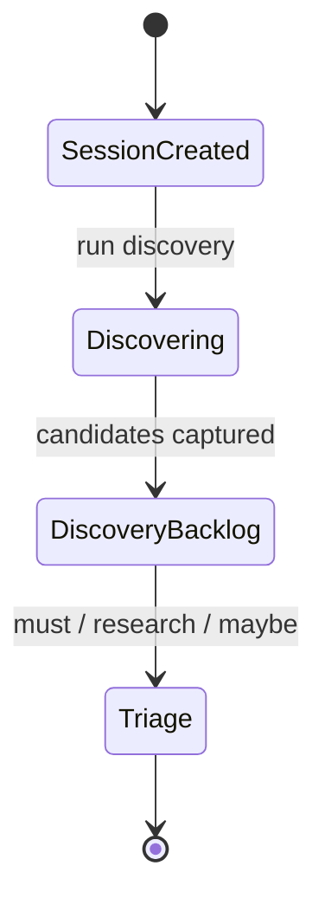
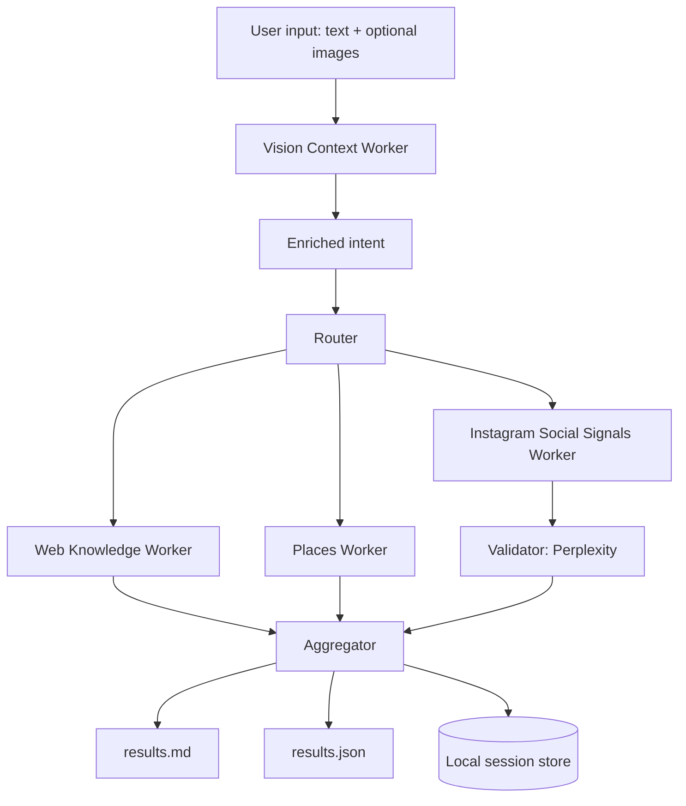

# Phase 0 PRD
## Travel Discovery Orchestrator (CLI-first)

**Owner:** Rajan

**Status:** Draft (Open Questions Resolved)

**Last updated:** 2026-01-01

---

## 1. Executive summary
Phase 0 delivers a CLI-first Discovery engine for a travel planning app. Users create travel **Sessions** (destination, dates, flexibility, interests, constraints). A **Router + Workers + Aggregator** pipeline runs in parallel to produce:

- **results.md**: human-friendly markdown for fast scanning and decision making
- **results.json**: canonical structured output designed to be used later by a web UI

Phase 0 intentionally does **not** include flights, bookings, payments, or ticketing. The focus is proving that multi-source orchestration produces consistently useful, trustworthy discovery results and clean handoff into a lightweight triage state.

---

## 2. Problem statement
Planning travel often starts with scattered inspiration, fragmented research, and inconsistent note-taking. Users need a workflow that:

- captures vague or specific travel ideas
- converts them into a structured backlog of candidates
- allows prioritization and refinement
- preserves provenance so results are trustworthy

The biggest early risk is building UI and infrastructure before validating that “Discovery orchestration” reliably produces good outputs.

---

## 3. Scope

### 3.1 In scope (Phase 0)
- Session creation and management
- Discovery orchestration pipeline with pluggable workers
- Multimodal input: user prompt plus optional images
- Canonical normalization into a Candidate schema
- Dedupe and clustering
- Ranking and diversity
- Social signals via Instagram (official, permissioned) where available
- Validation of social-derived candidates using Perplexity
- Lightweight triage status per candidate: Must do, Research, Maybe
- Local storage of runs, outputs, and raw worker results
- Evaluation harness for repeatability and quality checks

### 3.2 Out of scope (Phase 0)
- Booking flows: flights, hotels, tickets
- Real-time pricing guarantees
- Payments, loyalty, checkout
- Multi-user collaboration, sharing, permissions
- Full scheduling calendar UI
- Automated scraping that violates platform terms

---

## 4. Goals and success metrics

### 4.1 Product goals
1. Users can create and revisit Sessions representing travel ideas.
2. A Discovery run returns a ranked, deduped, well-cited set of Candidates.
3. Discovery output is durable and UI-ready (JSON contract).
4. Social inspiration is surfaced as “signals” and validated.
5. Users can triage candidates and preserve triage across runs.

### 4.2 Success metrics (Phase 0)
- **Utility:** User gives a positive rating (simple thumbs up) on the top 10 results in at least 80 percent of runs across a small evaluation set.
- **Trust:** 100 percent of factual Candidates include at least one SourceRef, or are explicitly marked as Needs verification.
- **Repeatability:** Same Session input yields broadly similar top candidates across reruns (allowing for source drift), and always produces valid JSON.
- **Resilience:** Pipeline completes with partial results if one worker fails.

---

## 5. Personas
1. **Explorer**: has a vague idea and wants inspiration.
2. **Curator**: wants a shortlist and prioritization.
3. **Planner (later)**: will convert shortlisted items into an itinerary in later phases.

---

## 6. User journeys

### 6.1 Journey A: Basic discovery
1. User creates a Session: “Japan in April, flexible by 7 days, food and temples”.
2. Runs discovery.
3. Reviews markdown summary and top picks.
4. Marks 5 items Must do, 5 items Research.
5. Exports results.

### 6.2 Journey B: Multimodal discovery
1. User creates a Session and uploads images (map screenshot, list screenshot, or inspiration photo).
2. Vision step extracts structured signals.
3. Discovery runs using enriched intent.
4. Results reflect extracted tags and entities.

### 6.3 Journey C: Social signals
1. User creates a Session: “Italy in May, wine and history”.
2. Instagram worker pulls relevant hashtag-based content (if enabled).
3. Social-derived candidates are validated via Perplexity.
4. Conflicts and unverified items are surfaced clearly.

---

## 7. High-level workflow model



Note: “Planning board” and “Scheduling” are future phases. In Phase 0 we only persist triage state to prove the handoff.

---

## 8. Functional requirements

### FR1: Session management
- Create Session with:
  - destination(s)
  - date range (start, end)
  - flexibility (none, plus-minus days, month-only)
  - interests (tags)
  - optional constraints (kid-friendly, mobility, dietary, budget band)
  - optional attachments (images)
- List Sessions
- View Session
- Archive Session

### FR2: Discovery run orchestration
A discovery run must:
- generate `run_id`
- execute workers in parallel with timeouts
- store raw worker outputs
- normalize results into canonical Candidate schema
- dedupe and cluster
- rank and diversify
- generate `results.json` and `results.md`

### FR3: Router
The Router produces a WorkerPlan:
- extracted intent and constraints
- query variants
- workers to call
- per-worker budgets (max calls, timeouts)
- validation plan (what needs verification)

### FR4: Vision Context extraction (multimodal)
If images are provided:
- extract structured signals into `vision_insights.json`
- augment Router intent and worker queries

Vision insights include:
- detected places (names and confidence)
- activity tags
- style tags (luxury, quiet, outdoors)
- text snippets
- constraints hints
- items flagged as needing verification

### FR5: Workers (Phase 0 set)
Phase 0 workers are pluggable. Minimum set:

1. **Web Knowledge Worker (Perplexity)**
   - Uses Perplexity Sonar API to research destination and interests.
   - Generates grounded answers with inline citations.
   - Extracts discrete Candidates from Perplexity responses.
   - Output normalized Candidates with SourceRefs from Perplexity citations.

2. **Places Worker (Google Places API)**
   - Queries Google Places API for POIs matching destination and interests.
   - Retrieves place details: name, address, ratings, reviews, photos, opening hours.
   - Generates synthetic SourceRef using Google Maps URL (`https://maps.google.com/?cid=<place_id>`).
   - Output normalized Candidates with `origin = places`.

3. **Instagram Social Signals Worker (permissioned, best-effort)**
   - Runs automatically based on user input.
   - Uses hashtag-based discovery via official APIs when available.
   - Produces Candidates tagged `origin = instagram` and `confidence = provisional`.

### FR6: Social validation via Perplexity
- For top N Instagram-derived candidates (default 10), validate:
  - place existence
  - correct location
  - obvious closure or mismatch
- Output validation status:
  - verified
  - partially_verified
  - conflict_detected
  - unverified
- Mark conflicts and unverified items clearly in markdown.

### FR7: Triage state
- User can assign each Candidate to:
  - Must do
  - Research
  - Maybe
- Triage persists across discovery reruns.

### FR8: Export
- Export a bundle per Session containing:
  - latest results.json
  - latest results.md
  - triage state
  - run metadata
  - optional raw worker outputs

---

## 9. Model strategy
Phase 0 uses multiple models for different responsibilities. Models are configured per task type so you can swap providers without rewriting orchestration.

### 9.1 Default model map
- **Router (intent extraction and plan):** Gemini 3 Flash
- **Vision Context extraction (images to structured signals):** GPT-5.2
- **Worker normalization (snippets to Candidates):** Gemini 3 Flash (fallback GPT-5.2)
- **Aggregator (dedupe, rank, JSON + markdown):** GPT-5.2
- **Optional long-context merge (large evidence sets):** Gemini 3 Pro
- **Validation for social claims:** Perplexity

### 9.2 Rules
- Aggregator must not introduce factual claims without evidence.
- Each Candidate must include at least one SourceRef or be explicitly flagged Needs verification.
- Social-derived candidates start as provisional until validated.

### 9.3 Cost and latency control
- Per-run token budgets per task type
- Per-worker timeouts
- Max number of social validations per run
- Concurrency caps

---

## 10. Architecture



### 10.1 Worker plugin interface (Node + TypeScript)
- Each worker implements:
  - `plan(session, enrichedIntent): WorkerPlan`
  - `execute(plan, context): Promise<WorkerOutput>`

### 10.2 Execution model
- Use parallel execution with `Promise.allSettled`.
- Partial results are allowed.
- Errors are recorded per worker and surfaced in run summary.

---

## 11. Data model

### 11.1 Session schema (conceptual)
- `session_id`
- `title`
- `destinations[]`
- `date_range { start, end }`
- `flexibility { type, days }`
- `interests[]`
- `constraints { ... }`
- `attachments[]`
- `created_at`

### 11.2 Attachment schema
- `attachment_id`
- `type = image`
- `mime_type`
- `hash`
- `created_at`

### 11.3 Candidate schema (canonical)
Minimum fields:
- `candidate_id`
- `type` (place, activity, neighborhood, daytrip, experience, food)
- `title`
- `summary`
- `location_text`
- `tags[]`
- `origin` (web, places, instagram)
- `source_refs[]`
- `confidence`:
  - `needs_verification` — no SourceRef available
  - `provisional` — social-derived, awaiting validation
  - `verified` — has confirmed SourceRef(s)
  - `high` — multiple high-quality sources or official source
- `validation { status, notes, sources[] }`
- `score`
- `cluster_id` (optional)

### 11.4 SourceRef schema
- `url`
- `publisher`
- `retrieved_at`
- `snippet` (optional, short)

### 11.5 Triage schema
- `candidate_id`
- `status` (must, research, maybe)
- `notes` (optional)
- `updated_at`

---

## 12. Storage layout (local)
- `sessions/<session_id>/session.json`
- `sessions/<session_id>/triage.json`
- `sessions/<session_id>/attachments/<attachment_id>.<ext>`
- `sessions/<session_id>/runs/<run_id>/raw/<worker>.json`
- `sessions/<session_id>/runs/<run_id>/vision_insights.json` (if images)
- `sessions/<session_id>/runs/<run_id>/results.json`
- `sessions/<session_id>/runs/<run_id>/results.md`

---

## 13. Ranking, dedupe, clustering

### 13.1 Dedupe
- If a stable place identifier is available, use it.
- Otherwise cluster by:
  - normalized title similarity
  - location text similarity
  - optional embeddings similarity (phase 0 optional)

### 13.2 Ranking
Score is computed using:
- relevance to destination and interests
- source credibility weighting
- validation boost (verified)
- diversity bonus (avoid monotony)
- redundancy penalty (cluster alternates)

### 13.3 Diversity constraints
- Enforce variety by type (not all temples, not all bars)
- Enforce geography spread if multiple destinations are present

---

## 14. Instagram social signals (Phase 0 positioning)

### 14.1 Operating principle
- Social results are inspiration signals.
- They require validation before being treated as factual recommendations.

### 14.2 Discovery approach
- Generate hashtags from destination and interests.
- Query public hashtag-based media via official APIs where permissions allow.
- Extract place-like entities and activities from captions.
- Produce Candidates with provenance.

### 14.3 Fallback behavior
If Instagram access is unavailable (permissions not granted, rate limited, outages):
- Disable Instagram worker for that run.
- Continue with other workers.
- Record a clear reason in the run summary.

---

## 15. CLI specification

### 15.1 Commands
- `travel sessions:create`
- `travel sessions:list`
- `travel sessions:view <session_id>`
- `travel sessions:archive <session_id>`
- `travel discover <session_id>`
- `travel triage:set <candidate_id> --status must|research|maybe`
- `travel export <session_id> --bundle`
- `travel eval:run`

### 15.2 Run summary output
- run id
- worker timings
- candidates count
- clusters count
- instagram candidates count
- validation statuses distribution
- output file paths

---

## 16. Non-functional requirements

### 16.1 Performance
- Default target: run completes under 20 seconds with partial results.
- Worker timeout default: 8 seconds.

### 16.2 Cost controls
- Per-run budget caps:
  - max worker calls
  - max LLM tokens per task
  - max social validations

### 16.3 Reliability
- Retries with exponential backoff for transient failures.
- Concurrency limits per provider.

### 16.4 Observability
- Structured logs:
  - `run_id`, `session_id`, worker, duration, error type
- Store raw outputs for reproducibility.

### 16.5 Privacy
- Store only what is needed for Sessions and outputs.
- Do not store unnecessary personal data.
- Attachments are stored locally in Phase 0.

---

## 17. Evaluation harness
Phase 0 includes an offline evaluation suite.

### 17.1 Evaluation inputs
20 to 30 curated session prompts across four categories:

**Category A: Vague/Exploratory** (tests inspiration mode)
- "Somewhere warm in March"
- "Beach vacation ideas"
- "Romantic getaway in Europe"
- "Adventure travel for solo traveler"

**Category B: Specific Destination + Interests** (tests focused discovery)
- "Japan in April, temples and food"
- "Barcelona for 5 days, architecture and nightlife"
- "Iceland in summer, nature and hiking"
- "Morocco, markets and desert"

**Category C: Constrained Trips** (tests constraint handling)
- "Family-friendly, wheelchair accessible, budget under $200/day"
- "Vegan-friendly destinations in Southeast Asia"
- "Pet-friendly beach towns in California"
- "Senior-friendly European river cruise stops"

**Category D: Multi-city / Complex** (tests geographic spread)
- "10 days: Tokyo → Kyoto → Osaka"
- "Italy wine regions tour"
- "Balkans road trip: Croatia, Montenegro, Albania"
- "South America: Lima, Cusco, Machu Picchu"

Additional scenarios:
- Image + prompt (map screenshot, inspiration photo)
- Flexible dates ("sometime in spring")

### 17.2 Checks
- JSON schema validation always passes.
- At least N Candidates are produced (configurable).
- Top results include source refs.
- Social items are labeled and validated.
- No worker error prevents output generation.

### 17.3 Output
- A report per run with pass/fail and deltas.

---

## 18. Acceptance criteria
1. User can create a Session and run discovery.
2. Discovery generates `results.json` and `results.md` and stores raw worker outputs.
3. If images are provided, `vision_insights.json` is generated and influences results.
4. Pipeline runs at least three workers in parallel and completes with partial results if one fails.
5. Instagram worker runs automatically when enabled and produces provisional social Candidates.
6. Top N social Candidates are validated via Perplexity with clear status.
7. Dedupe produces clusters and reduces obvious repeats.
8. Triage persists across reruns and is included in exports.

---

## 19. Delivery plan (implementation slices)

### Slice A: Foundations
- Repo setup Node + TS
- Local store layout
- Worker interface
- Router stub
- CLI scaffolding

### Slice B: Discovery core
- Web Knowledge worker
- Places worker
- Aggregator to JSON and markdown
- Caching and logs

### Slice C: Multimodal
- Vision Context worker
- Enriched intent routing

### Slice D: Social + validation
- Instagram worker (permissioned)
- Perplexity validation worker
- Clear labeling and conflict surfacing

### Slice E: Quality
- Clustering and ranking
- Evaluation harness
- Triage persistence
- Export bundle

---

## 20. Risks and mitigations

### Risk: Instagram permissions and limitations
- Mitigation: treat as best-effort worker with graceful fallback.

### Risk: Social hype, outdated claims
- Mitigation: validation step, confidence labels, conflict surfacing.

### Risk: Hallucinated candidates
- Mitigation: enforce SourceRef rules and schema checks.

### Risk: Scope creep into bookings
- Mitigation: explicitly out of scope for Phase 0.

---

## 21. Resolved questions

1. **Which Places provider is preferred for Phase 0?**
   - **Decision:** Google Places API
   - Rationale: Best data quality, widest coverage, well-documented. Candidates from Places get a synthetic SourceRef pointing to the Google Maps URL for that `place_id`.

2. **Which web discovery mechanism is preferred?**
   - **Decision:** Perplexity as research worker
   - Rationale: Already proven in sister project for validation. Generates grounded answers with citations. Single API serves both Web Knowledge Worker and social validation roles.

3. **How strict should SourceRef enforcement be for non-social candidates?**
   - **Decision:** Tiered confidence
   - No SourceRef → `needs_verification` confidence
   - Has SourceRef → `verified` or `high` confidence
   - Let the UI/markdown surface the difference rather than blocking candidates without sources.

4. **What is the minimal markdown format that is still "UI-like" and scannable?**
   - **Decision:** Hybrid format with compact cards + appendix
   - Top 20 candidates presented as compact cards upfront (title + 1-line summary + tags)
   - Full details for all candidates in appendix sections
   - Best of both: quick scanning and deep-dive available

5. **What is the initial evaluation prompt set you care about most?**
   - **Decision:** All four categories
   - Vague/exploratory: "Somewhere warm in March", "Beach vacation ideas"
   - Specific destination + interests: "Japan in April, temples and food"
   - Constrained trips: "Family-friendly, wheelchair accessible, budget under $200/day"
   - Multi-city / complex: "10 days: Tokyo → Kyoto → Osaka", "Italy wine regions tour"

---

## Appendix A: TypeScript types (starter)

```ts
export type Flexibility =
  | { type: "none" }
  | { type: "plusMinusDays"; days: number }
  | { type: "monthOnly"; month: string };

export type Attachment = {
  attachmentId: string;
  type: "image";
  mimeType: string;
  hash: string;
  createdAt: string;
};

export type Session = {
  sessionId: string;
  title: string;
  destinations: string[];
  dateRange: { start: string; end: string };
  flexibility: Flexibility;
  interests: string[];
  constraints?: Record<string, unknown>;
  attachments?: Attachment[];
  createdAt: string;
  archivedAt?: string;
};

export type SourceRef = {
  url: string;
  publisher?: string;
  retrievedAt: string;
  snippet?: string;
};

export type ValidationStatus =
  | "verified"
  | "partially_verified"
  | "conflict_detected"
  | "unverified"
  | "not_applicable";

export type Candidate = {
  candidateId: string;
  type: "place" | "activity" | "neighborhood" | "daytrip" | "experience" | "food";
  title: string;
  summary: string;
  locationText?: string;
  tags: string[];
  origin: "web" | "places" | "instagram";
  sourceRefs: SourceRef[];
  confidence: "needs_verification" | "provisional" | "verified" | "high";
  validation?: {
    status: ValidationStatus;
    notes?: string;
    sources?: SourceRef[];
  };
  score: number;
  clusterId?: string;
};

export type TriageStatus = "must" | "research" | "maybe";

export type TriageEntry = {
  candidateId: string;
  status: TriageStatus;
  notes?: string;
  updatedAt: string;
};

export type DiscoveryResults = {
  sessionId: string;
  runId: string;
  createdAt: string;
  enrichedIntent?: Record<string, unknown>;
  candidates: Candidate[];
  clusters?: Array<{ clusterId: string; representativeCandidateId: string; alternateCandidateIds: string[] }>;
  workerSummary: Array<{ workerId: string; status: "ok" | "error"; durationMs: number; errorMessage?: string }>;
};
```

---

## Appendix B: results.md outline

### Format: Hybrid (compact cards + appendix)

```markdown
# Discovery Results: [Session Title]

## Session Summary
- **Destinations:** ...
- **Dates:** ... (flexibility: ...)
- **Interests:** ...
- **Constraints:** ...

## Highlights
- [5 key takeaways as bullets]

## Top Picks (up to 20 compact cards)
Each card: ~3 lines
- **[Title]** — [1-line summary]
  `[tag1]` `[tag2]` `[tag3]` | [confidence] | [source]

## Social Signals
- Instagram-derived candidates with validation status
- Conflicts and unverified items called out

## Suggested Refinements
- [2-3 questions to narrow or expand search]

---

## Appendix: Full Details

### [Candidate Title]
- **Type:** place | activity | ...
- **Location:** ...
- **Summary:** [full paragraph]
- **Tags:** ...
- **Sources:** [linked citations]
- **Confidence:** ...
- **Cluster:** [if part of cluster, list alternates]

[Repeat for all candidates]

---

## Sources Index
[Numbered list of all SourceRefs with URLs]
```

